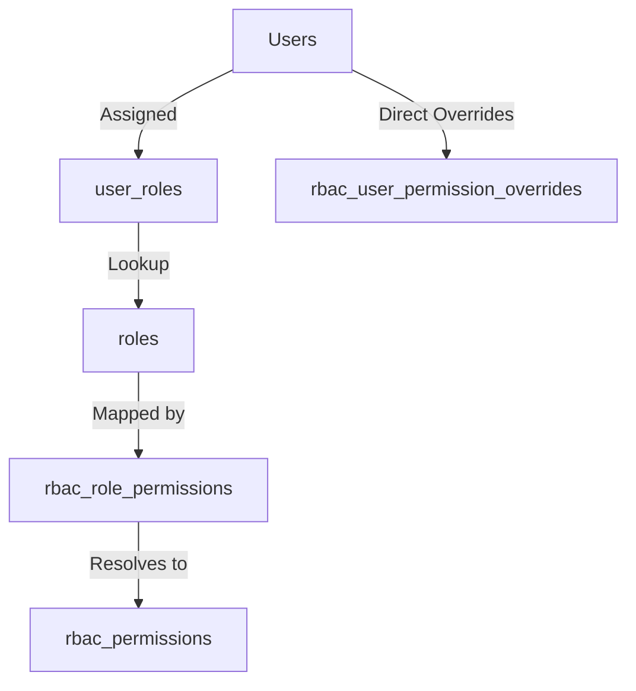

# Dynamic Role-Based Access Control (RBAC) System

This document outlines the architecture, data models, and programmatic interface of Sentinel's Dynamic Role-Based Access Control (RBAC) system.

---

## 1. System Overview

Sentinel uses a three-layer database-backed RBAC model that decouples permissions logic from application source code. Adding new roles or mapping existing permissions to roles is done entirely via database rows, requiring zero code modifications.



### The Three Layers

1. **Roles (`roles`)**: Defines job functions (e.g., `admin`, `instructor`, `support`). Core system roles are protected by the `is_system` flag.
2. **Permissions (`rbac_permissions`)**: Canonical registry of system capabilities, structured as `resource:action` (e.g., `rooms:manage`).
3. **Role Permissions Map (`rbac_role_permissions`)**: Maps specific roles to their allowed permission keys.

---

## 2. Permission Key Naming Convention

All permissions are registry entries that represent fine-grained action capabilities. Keys follow the format:

$$\text{permission\_key} = \text{resource} : \text{action}$$

| Segment    | Description                                                  | Examples                                                    |
| ---------- | ------------------------------------------------------------ | ----------------------------------------------------------- |
| `resource` | Noun in lowercase kebab-case, identifying the module target. | `rooms`, `semesters`, `assessments`, `institutions`         |
| `action`   | Verb representing the capability scope.                      | `view`, `manage` (write/create/delete), `cross-tenant-view` |

---

## 3. How to Manage Roles and Permissions

### How to Add a New Role (No Code Changes)

To define a new custom role, insert a row directly into the `roles` table:

```sql
INSERT INTO roles (role_name, slug, description, assignable_by, is_system)
VALUES ('Exam Coordinator', 'exam-coordinator', 'Coordinates institution exams', ARRAY['admin', 'superadmin'], false);
```

To grant permissions to this role, map permission IDs to the role ID in `rbac_role_permissions`:

```sql
INSERT INTO rbac_role_permissions (role_id, permission_id)
VALUES (15, 'a1b2c3d4-e5f6-7a8b-9c0d-1e2f3a4b5c6d'); -- ID of assessments:manage
```

### How to Add a New Permission Key

System permissions must be declared in code first so they are synced into the database upon platform bootstrap:

1. Open the shared permissions constant definition file: [permissions.ts](file:///Applications/XAMPP/xamppfiles/htdocs/sentinel/packages/shared/src/constants/permissions.ts)
2. Add your new permission under `PERMISSIONS`:
    ```typescript
    NEW_PERM: {
        id: 'my-resource:action',
        moduleKey: 'my-resource',
        actionKey: 'action',
        scope: 'institution',
        name: 'My Action Name',
        description: 'Allows my action.',
        category: 'SYSTEM',
    }
    ```
3. Map the permission key to the appropriate default roles in the `SYSTEM_ROLE_BLUEPRINTS` object.
4. Run the database seed/sync task. During test and production startup, the bootstrap sequence automatically upserts all declared permissions.

---

## 4. API Reference

All route protection and context resolution are built upon three core utilities defined in [permissions.ts](file:///Applications/XAMPP/xamppfiles/htdocs/sentinel/app/sentinel-api/src/lib/permissions.ts):

### `hasActivePermission`

Synchronously checks whether a required permission key (or any array of keys) is present in a set of permission keys or a Hono request Context.

```typescript
import { hasActivePermission } from '@/lib/permissions';

// Using a Set of keys
const hasAccess = hasActivePermission(activeKeysSet, 'rooms:view');

// Using the Hono context
const canManage = hasActivePermission(c, ['rooms:manage', 'institutions:manage']);
```

### `requireActivePermission`

Throws an HTTP `403 Forbidden` exception if the user does not possess the required permission. Use this inside controllers or service functions where the Hono Context is available.

```typescript
import { requireActivePermission } from '@/lib/permissions';

export const myHandler = async (c) => {
    requireActivePermission(c, 'assessments:manage');
    // ... handler execution
};
```

### `requirePermission` (Hono Middleware)

Declares route-level guards directly in the route registration.

```typescript
import { requirePermission } from '@/lib/permissions';

app.post('/rooms', requirePermission('rooms:manage'), roomHandler);
app.get('/semesters', requirePermission('semesters:view'), semestersHandler);
```

---

## 5. Security Invariants

- **`is_system` Role Protection**: Any role where `is_system` is `true` is protected from modification/deletion in the service layer, preventing accidental lockouts.
- **`assignable_by` Hierarchy**: Users can only assign or revoke roles that are listed in the role's `assignable_by` array, enforcing strict administrative scoping.
