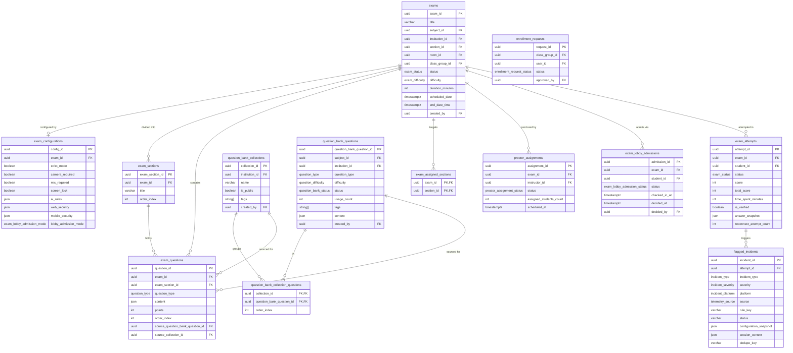
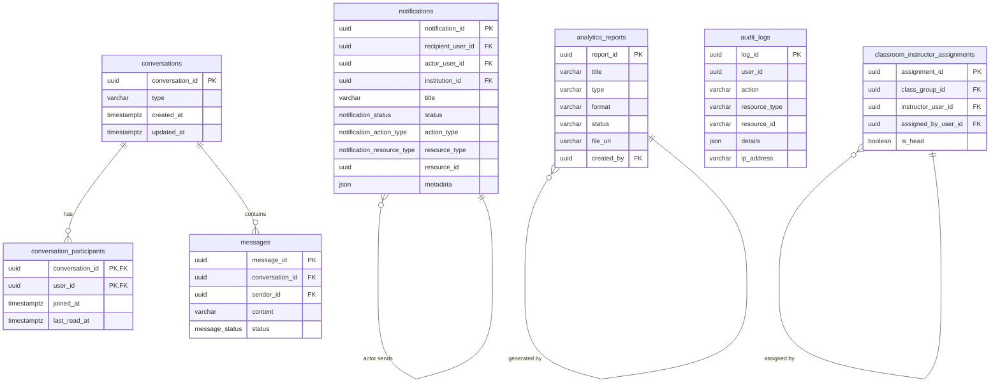
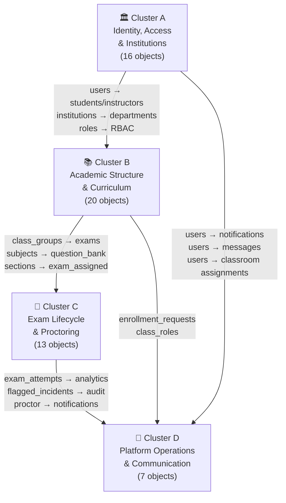

> [!NOTE]
> **Canonical location:** [.agents/docs/architecture/erd-clusters.md](../../../.agents/docs/architecture/erd-clusters.md)

# Sentinel ERD — Four-Cluster Breakdown

> **Purpose:** This document breaks all 56 database objects into four cohesive clusters aligned with the system's operational phases. Each cluster is presented as a separate ERD figure so diagrams remain readable in DBeaver or any ER tool.

---

## Overview — Cluster Map

| Cluster | Phase                                | Object Count | Core Anchor                      |
| ------- | ------------------------------------ | ------------ | -------------------------------- |
| **A**   | Identity, Access & Institution Setup | 16           | `users` / `institutions`         |
| **B**   | Academic Structure & Curriculum      | 20           | `courses` / `subjects` / `terms` |
| **C**   | Exam Lifecycle & Proctoring          | 13           | `exams` / `exam_attempts`        |
| **D**   | Platform Operations & Communication  | 7            | `notifications` / `audit_logs`   |

> The `auth.users` table (Supabase-managed) appears in all clusters as the **global identity anchor** but is only drawn in full in **Cluster A**.

---

## Figure A — Identity, Access & Institution Setup

**Operational Phase:** Onboarding → Role Assignment → Institutional Hierarchy

**Objects (16):**

| #   | Table                            | Schema |
| --- | -------------------------------- | ------ |
| 1   | `users`                          | auth   |
| 2   | `user_profiles`                  | public |
| 3   | `user_roles`                     | public |
| 4   | `roles`                          | public |
| 5   | `rbac_permissions`               | public |
| 6   | `rbac_role_permissions`          | public |
| 7   | `rbac_user_permission_overrides` | public |
| 8   | `institutions`                   | public |
| 9   | `institution_naming_conventions` | public |
| 10  | `departments`                    | public |
| 11  | `instructors`                    | public |
| 12  | `students`                       | public |
| 13  | `student_whitelist`              | public |
| 14  | `system_settings`                | public |
| 15  | `announcements`                  | public |
| 16  | `rooms`                          | public |

```mermaid
erDiagram
    users {
        uuid id PK
        varchar email
        varchar role
        boolean is_anonymous
    }
    user_profiles {
        uuid user_id PK,FK
        varchar first_name
        varchar last_name
        varchar avatar_url
        uuid institution_id FK
        uuid department_id FK
        uuid course_id FK
        user_status status
    }
    user_roles {
        uuid user_id PK,FK
        smallint role_id PK,FK
        timestamptz assigned_at
    }
    roles {
        smallint role_id PK
        varchar role_name
        boolean is_system
    }
    rbac_permissions {
        uuid permission_id PK
        varchar permission_key
        varchar module_key
        varchar action_key
        varchar scope
    }
    rbac_role_permissions {
        smallint role_id PK,FK
        uuid permission_id PK,FK
    }
    rbac_user_permission_overrides {
        uuid user_id PK,FK
        uuid permission_id PK,FK
        varchar effect
    }
    institutions {
        uuid id PK
        varchar name
        varchar code
        uuid parent_institution_id FK
        institution_kind institution_kind
    }
    institution_naming_conventions {
        uuid institution_naming_convention_id PK
        uuid institution_id FK
        varchar section_code_format
        varchar room_code_format
        json naming_rules
    }
    departments {
        uuid department_id PK
        varchar department_name
        uuid institution_id FK
        uuid source_record_id FK
        inheritance_status inheritance_status
    }
    instructors {
        uuid instructor_id PK
        uuid user_id FK
        varchar employee_number
        uuid department_id FK
        uuid institution_id FK
    }
    students {
        uuid student_id PK
        uuid user_id FK
        varchar student_number
        uuid department_id FK
        uuid institution_id FK
        uuid course_id FK
    }
    student_whitelist {
        uuid whitelist_id PK
        uuid institution_id FK
        uuid department_id FK
        uuid course_id FK
        varchar student_number
        uuid claimed_user_id FK
    }
    system_settings {
        uuid system_setting_id PK
        varchar category
        varchar setting_key
        json setting_value
    }
    announcements {
        uuid announcement_id PK
        varchar title
        uuid author_id FK
        uuid institution_id FK
        announcement_status status
    }
    rooms {
        uuid room_id PK
        varchar room_name
        varchar room_number
        uuid institution_id
        room_type room_type
        uuid source_record_id FK
        inheritance_status inheritance_status
    }

    users ||--o| user_profiles : "has profile"
    users ||--o{ user_roles : "assigned"
    roles ||--o{ user_roles : "defines"
    roles ||--o{ rbac_role_permissions : "has"
    rbac_permissions ||--o{ rbac_role_permissions : "in"
    rbac_permissions ||--o{ rbac_user_permission_overrides : "overridden by"
    users }o--o{ rbac_user_permission_overrides : "overrides"
    institutions ||--o{ departments : "has"
    institutions ||--o| institution_naming_conventions : "configures"
    institutions ||--o{ instructors : "employs"
    institutions ||--o{ students : "enrolls"
    institutions ||--o{ student_whitelist : "whitelists"
    institutions ||--o{ announcements : "publishes"
    institutions }o--o{ institutions : "parent-child"
    departments ||--o{ instructors : "belongs to"
    departments ||--o{ students : "belongs to"
    departments ||--o{ student_whitelist : "restricts"
    departments }o--o{ departments : "source inherit"
    users ||--o| instructors : "is"
    users ||--o| students : "is"
    users ||--o{ student_whitelist : "claims"
    users ||--o{ announcements : "authors"
```

---

## Figure B — Academic Structure & Curriculum

**Operational Phase:** Curriculum Design → Class Formation → Enrollment

**Objects (20):**

| #   | Table                             | Schema |
| --- | --------------------------------- | ------ |
| 1   | `terms`                           | public |
| 2   | `courses`                         | public |
| 3   | `course_subjects`                 | public |
| 4   | `instructor_courses`              | public |
| 5   | `subjects`                        | public |
| 6   | `subject_classifications`         | public |
| 7   | `subject_classification_subjects` | public |
| 8   | `subject_classification_courses`  | public |
| 9   | `subject_departments`             | public |
| 10  | `subject_sections`                | public |
| 11  | `subject_year_levels`             | public |
| 12  | `subject_offerings`               | public |
| 13  | `subject_offering_courses`        | public |
| 14  | `subject_offering_departments`    | public |
| 15  | `subject_offering_sections`       | public |
| 16  | `subject_offering_year_levels`    | public |
| 17  | `sections`                        | public |
| 18  | `class_groups`                    | public |
| 19  | `class_roles`                     | public |
| 20  | `enrollments`                     | public |

```mermaid
erDiagram
    terms {
        uuid term_id PK
        varchar academic_year
        varchar semester
        boolean is_active
        uuid institution_id FK
        uuid source_record_id FK
    }
    courses {
        uuid course_id PK
        varchar code
        varchar title
        uuid department_id FK
        uuid institution_id FK
        uuid source_record_id FK
        inheritance_status inheritance_status
    }
    course_subjects {
        uuid course_id PK,FK
        uuid subject_id PK,FK
        smallint year_level
        varchar semester
    }
    instructor_courses {
        uuid instructor_id PK,FK
        uuid course_id PK,FK
    }
    subjects {
        uuid subject_id PK
        varchar subject_code
        varchar subject_title
        uuid institution_id FK
        uuid term_id FK
        uuid source_record_id FK
        inheritance_status inheritance_status
    }
    subject_classifications {
        uuid subject_classification_id PK
        varchar name
        varchar classification_type
        uuid institution_id FK
        uuid department_id FK
        uuid source_record_id FK
    }
    subject_classification_subjects {
        uuid subject_classification_id PK,FK
        uuid subject_id PK,FK
    }
    subject_classification_courses {
        uuid subject_classification_id PK,FK
        uuid course_id PK,FK
    }
    subject_departments {
        uuid subject_id PK,FK
        uuid department_id PK,FK
    }
    subject_sections {
        uuid subject_id PK,FK
        uuid section_id PK,FK
    }
    subject_year_levels {
        uuid subject_id PK,FK
        smallint year_level PK
    }
    subject_offerings {
        uuid subject_offering_id PK
        uuid subject_id FK
        uuid term_id FK
        uuid institution_id FK
        subject_offering_status status
        uuid source_record_id FK
    }
    subject_offering_courses {
        uuid subject_offering_id PK,FK
        uuid course_id PK,FK
    }
    subject_offering_departments {
        uuid subject_offering_id PK,FK
        uuid department_id PK,FK
    }
    subject_offering_sections {
        uuid subject_offering_id PK,FK
        uuid section_id PK,FK
    }
    subject_offering_year_levels {
        uuid subject_offering_id PK,FK
        smallint year_level PK
    }
    sections {
        uuid section_id PK
        varchar section_name
        smallint year_level
        uuid department_id FK
        uuid course_id FK
        uuid institution_id FK
        uuid source_record_id FK
        inheritance_status inheritance_status
    }
    class_groups {
        uuid class_group_id PK
        uuid subject_id FK
        uuid section_id FK
        uuid term_id FK
        uuid institution_id FK
        uuid subject_offering_id FK
        varchar class_name
    }
    class_roles {
        uuid class_group_id PK,FK
        uuid user_id PK,FK
        smallint role_id PK,FK
    }
    enrollments {
        uuid enrollment_id PK
        uuid class_group_id FK
        uuid student_id FK
    }

    terms ||--o{ subjects : "scopes"
    terms ||--o{ subject_offerings : "frames"
    terms ||--o{ class_groups : "groups in"
    courses ||--o{ course_subjects : "has"
    courses ||--o{ sections : "has"
    courses ||--o{ instructor_courses : "taught by"
    courses ||--o{ subject_offering_courses : "offered in"
    courses ||--o{ subject_classification_courses : "classified by"
    subjects ||--o{ course_subjects : "in"
    subjects ||--o{ subject_offerings : "offered as"
    subjects ||--o{ subject_classification_subjects : "tagged"
    subjects ||--o{ subject_departments : "mapped to dept"
    subjects ||--o{ subject_sections : "mapped to section"
    subjects ||--o{ subject_year_levels : "for year"
    subjects ||--o{ class_groups : "taught in"
    subject_classifications ||--o{ subject_classification_subjects : "tags"
    subject_classifications ||--o{ subject_classification_courses : "scopes"
    subject_offerings ||--o{ subject_offering_courses : "for course"
    subject_offerings ||--o{ subject_offering_departments : "for dept"
    subject_offerings ||--o{ subject_offering_sections : "for section"
    subject_offerings ||--o{ subject_offering_year_levels : "for year"
    subject_offerings ||--o{ class_groups : "results in"
    sections ||--o{ class_groups : "hosts"
    sections ||--o{ subject_sections : "links"
    sections ||--o{ subject_offering_sections : "links"
    sections }o--o{ sections : "source inherit"
    class_groups ||--o{ class_roles : "has roles"
    class_groups ||--o{ enrollments : "has"
```

---

## Figure C — Exam Lifecycle & Proctoring

**Operational Phase:** Exam Creation → Lobby → Active Proctoring → Post-Exam Review

**Objects (13):**

| #   | Table                                | Schema |
| --- | ------------------------------------ | ------ |
| 1   | `exams`                              | public |
| 2   | `exam_configurations`                | public |
| 3   | `exam_sections`                      | public |
| 4   | `exam_questions`                     | public |
| 5   | `exam_assigned_sections`             | public |
| 6   | `question_bank_collections`          | public |
| 7   | `question_bank_questions`            | public |
| 8   | `question_bank_collection_questions` | public |
| 9   | `proctor_assignments`                | public |
| 10  | `exam_lobby_admissions`              | public |
| 11  | `exam_attempts`                      | public |
| 12  | `flagged_incidents`                  | public |
| 13  | `enrollment_requests`                | public |

---

## Figure D — Platform Operations & Communication

**Operational Phase:** In-Session Monitoring → Post-Exam Analytics → Ongoing Platform Operations

**Objects (7):**

| #   | Table                              | Schema |
| --- | ---------------------------------- | ------ |
| 1   | `notifications`                    | public |
| 2   | `conversations`                    | public |
| 3   | `conversation_participants`        | public |
| 4   | `messages`                         | public |
| 5   | `analytics_reports`                | public |
| 6   | `audit_logs`                       | public |
| 7   | `classroom_instructor_assignments` | public |

---

## Cross-Cluster Relationship Summary

The diagram below shows how the four clusters connect at a high level without duplicating internal details.

---

## Notes for DBeaver ERD Generation

When generating these in DBeaver, apply the following filter sets:

| DBeaver Filter | Tables to Include                                                                                                                                                                                                                                                                                                                                                                                                                                 |
| -------------- | ------------------------------------------------------------------------------------------------------------------------------------------------------------------------------------------------------------------------------------------------------------------------------------------------------------------------------------------------------------------------------------------------------------------------------------------------- |
| **Filter A**   | `users`, `user_profiles`, `user_roles`, `roles`, `rbac_permissions`, `rbac_role_permissions`, `rbac_user_permission_overrides`, `institutions`, `institution_naming_conventions`, `departments`, `instructors`, `students`, `student_whitelist`, `system_settings`, `announcements`, `rooms`                                                                                                                                                      |
| **Filter B**   | `terms`, `courses`, `course_subjects`, `instructor_courses`, `subjects`, `subject_classifications`, `subject_classification_subjects`, `subject_classification_courses`, `subject_departments`, `subject_sections`, `subject_year_levels`, `subject_offerings`, `subject_offering_courses`, `subject_offering_departments`, `subject_offering_sections`, `subject_offering_year_levels`, `sections`, `class_groups`, `class_roles`, `enrollments` |
| **Filter C**   | `exams`, `exam_configurations`, `exam_sections`, `exam_questions`, `exam_assigned_sections`, `question_bank_collections`, `question_bank_questions`, `question_bank_collection_questions`, `proctor_assignments`, `exam_lobby_admissions`, `exam_attempts`, `flagged_incidents`, `enrollment_requests`                                                                                                                                            |
| **Filter D**   | `notifications`, `conversations`, `conversation_participants`, `messages`, `analytics_reports`, `audit_logs`, `classroom_instructor_assignments`                                                                                                                                                                                                                                                                                                  |

> **Tip:** In each diagram, include `users` and `institutions` as **ghost/stub nodes** (no column expansion) to show the FK anchor without flooding the diagram with auth-schema columns.
