> [!NOTE]
> **Canonical location:** [.agents/docs/architecture/hipo-diagram.md](../../../.agents/docs/architecture/hipo-diagram.md)

# HIPO Diagram: Sentinel Platform

The HIPO (Hierarchy plus Input-Process-Output) diagram provides a comprehensive view of the Sentinel system's functional structure and its data processing logic.

## 1. Hierarchy Chart (VTOC - Visual Table of Contents)

This chart illustrates the top-down functional decomposition of the Sentinel monorepo.

```mermaid
graph TD
    %% Root
    Sentinel["Sentinel Platform (Turborepo Monorepo)"]

    %% Level 1: Core Layers
    Sentinel --> Frontend["Frontend Applications"]
    Sentinel --> Backend["Backend API (Hono)"]
    Sentinel --> Telemetry["Real-Time & AI Services"]
    Sentinel --> DataLayer["Data & Persistence Layer"]
    Sentinel --> Shared["Shared Infrastructure"]

    %% Level 2: Frontend
    Frontend --> WebApp["sentinel-web (Next.js - Student/Instructor)"]
    Frontend --> CoreApp["sentinel-core (Next.js - Admin/Superadmin)"]
    Frontend --> SupportApp["sentinel-support (Next.js - Support Portal)"]
    Frontend --> MobileApp["sentinel-mobile (Expo - Mobile Client)"]

    WebApp -.-> WebState["Zustand (State)"]
    WebApp -.-> WebHooks["TanStack (Query)"]

    %% Level 2: Backend
    Backend --> HonoRouter["Hono (Routing & OpenAPI)"]
    Backend --> Controllers["Controller Layer (HTTP)"]
    Backend --> Services["Service Layer (Business Logic)"]
    Backend --> DAL["Data Access Layer (Kysely)"]

    %% Level 2: Telemetry & AI
    Telemetry --> LiveKit["LiveKit (WebRTC A/V Transport)"]
    Telemetry --> MediaPipe["MediaPipe (Edge ML/Gaze Tracking)"]
    Telemetry --> BullMQ["BullMQ (Async Event Queue)"]
    Telemetry --> Gemini["Gemini AI (Question Generation)"]

    %% Level 2: Data
    DataLayer --> Supabase["Supabase (Auth & PostgreSQL)"]
    DataLayer --> Prisma["Prisma (Schema & Migrations)"]
    DataLayer --> Redis["Redis (In-Memory Cache)"]

    %% Level 2: Shared
    Shared --> SharedLogic["@sentinel/shared (Types/Schemas)"]
    Shared --> SharedUI["@sentinel/ui (Component Library)"]

    %% Styling
    classDef root fill:#1f2937,stroke:#111827,stroke-width:2px,color:#fff,font-weight:bold,rx:5px,ry:5px;
    classDef layer fill:#3b82f6,stroke:#2563eb,stroke-width:2px,color:#fff,font-weight:bold,rx:5px,ry:5px;
    classDef node fill:#eff6ff,stroke:#93c5fd,stroke-width:2px,color:#1e3a8a,rx:5px,ry:5px;
    classDef subnode fill:#f8fafc,stroke:#cbd5e1,stroke-width:1px,color:#475569,stroke-dasharray: 5 5,rx:5px,ry:5px;

    class Sentinel root;
    class Frontend,Backend,Telemetry,DataLayer,Shared layer;
    class WebApp,CoreApp,SupportApp,MobileApp,HonoRouter,Controllers,Services,DAL,LiveKit,MediaPipe,BullMQ,Gemini,Supabase,Prisma,Redis,SharedLogic,SharedUI node;
    class WebState,WebHooks subnode;
```

---

## 2. Input-Process-Output (IPO) Diagrams

The following tables describe the data transformation processes for key system operations.

### A. User Authentication & Authorization

| Input                                                      | Process                                                                                                                        | Output                                              |
| :--------------------------------------------------------- | :----------------------------------------------------------------------------------------------------------------------------- | :-------------------------------------------------- |
| User Credentials (Email/Password), OAuth Provider response | 1. Supabase Auth validates credentials. 2. Hono middleware extracts JWT. 3. Service layer checks role permissions in DB. | Auth Session Token, User Profile, Permission Scopes |

### B. Exam Monitoring & Anomaly Detection

| Input                                            | Process                                                                                                                                                  | Output                                                        |
| :----------------------------------------------- | :------------------------------------------------------------------------------------------------------------------------------------------------------- | :------------------------------------------------------------ |
| Webcam Feed, Audio Stream, Mouse/Keyboard Events | 1. MediaPipe processes video at the edge (Gaze/Face). 2. Web Worker runs YAMNet for audio analysis. 3. Telemetry service batches events to BullMQ. | Real-time Proctored Alerts, Anomaly Logs, AI Severity Scoring |

### C. Resource Management (CRUD Operations)

| Input                                         | Process                                                                                                                                          | Output                                                        |
| :-------------------------------------------- | :----------------------------------------------------------------------------------------------------------------------------------------------- | :------------------------------------------------------------ |
| Frontend Form Data (Zod Validated), Entity ID | 1. Hono Controller validates DTO. 2. Service layer executes business logic. 3. Kysely runs optimized SQL query via Prisma-generated types. | JSON API Response (success/data/error), DB Record Persistence |

### D. AI-Powered Question Generation

| Input                                                       | Process                                                                                                                                                   | Output                                          |
| :---------------------------------------------------------- | :-------------------------------------------------------------------------------------------------------------------------------------------------------- | :---------------------------------------------- |
| Course Syllabus, Learning Objectives, Difficulty Parameters | 1. Gemini AI receives prompt context. 2. Backend validates generated content against Shared Schema. 3. System saves new questions to Question Bank. | Formatted Question Objects, Assessment Metadata |

---

## 3. Component Responsibility Matrix

| Component            | Primary Responsibility                            | Key Technology                    |
| :------------------- | :------------------------------------------------ | :-------------------------------- |
| **sentinel-web**     | Student/Instructor interaction & Proctoring UI    | Next.js, Tailwind, TanStack Query |
| **sentinel-core**    | Administrative controls & Institutional oversight | Next.js, Radix UI, Zustand        |
| **sentinel-support** | Technical support & System monitoring             | Next.js, Shared UI                |
| **sentinel-api**     | Type-safe business logic & API orchestration      | Hono, Zod-OpenAPI, Kysely         |
| **sentinel-mobile**  | Native mobile experience                          | Expo, React Native                |
| **Shared Package**   | Centralized types, validation, and design system  | TypeScript, Zod, Tailwind v4      |
