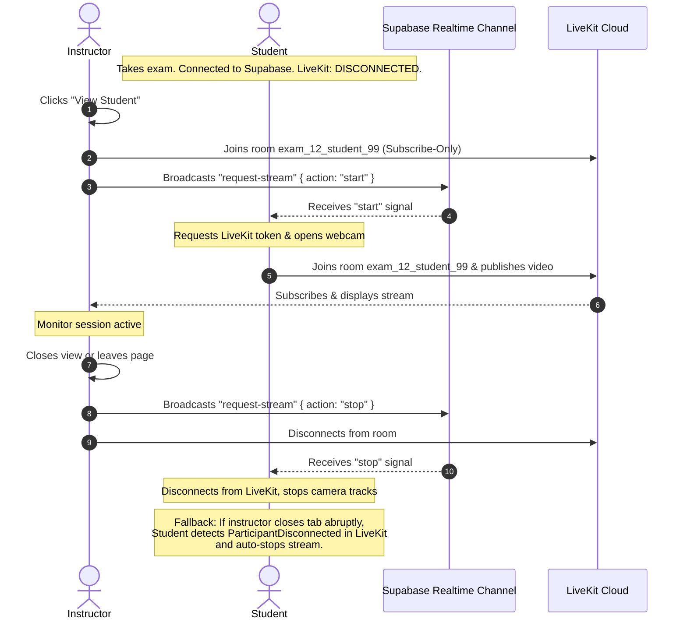

# LiveKit Live Video Monitoring Strategy

This document details the architecture, UX trigger flow, WebRTC cost analysis, and hosting trade-offs for implementing LiveKit-based student video monitoring in Sentinel.

---

## 1. Overview

Sentinel's real-time monitoring feature allows instructors to inspect a student's webcam feed when anomaly flags (such as gaze deviations or browser tab switching) are detected.

To bypass LiveKit Cloud's **100 concurrent participant limit** on the free tier, Sentinel integrates **Supabase Realtime** for signaling. Students do not connect to LiveKit at the start of an exam. Instead, they remain disconnected until the instructor actively requests a stream, dropping concurrent LiveKit usage to near zero.

---

## 2. Supabase Realtime Signaling Architecture

The student client connects to a Supabase Realtime broadcast channel during the exam. LiveKit is only engaged on-demand when signaling events are received.



### Signaling Flow Breakdown:

1. **Background State:** The student is taking the exam. They listen to a Supabase Realtime Broadcast channel: `exam:[examId]:monitoring`. LiveKit is **disconnected**, consuming 0 minutes and 0 concurrent slots.
2. **Connection Trigger:**
    - The instructor clicks "View Student".
    - The instructor joins the LiveKit room: `exam_[examId]_student_[studentId]`.
    - The instructor broadcasts a Supabase Realtime event:
        ```json
        {
            "event": "request-stream",
            "payload": {
                "studentId": "student_99",
                "action": "start"
            }
        }
        ```
3. **Webcam Activation:**
    - The student browser receives the event. If `studentId` matches their ID, they fetch a token, connect to the LiveKit room, and publish their camera track.
4. **Disconnection Trigger:**
    - When the instructor closes the modal or leaves the page, they broadcast the event with `action: "stop"` and disconnect from LiveKit.
    - The student receives the `"stop"` signal, disconnects from LiveKit, and releases the camera device.
5. **Fail-Safe Mechanism:**
    - If the instructor's browser crashes or they lose connection before sending the `"stop"` signal, the student's LiveKit listener will fire a `ParticipantDisconnected` event. If the student detects they are the only participant left in the room, they will automatically disconnect and close the camera.

---

## 3. WebRTC Minutes & Free Tier Compliance

LiveKit Cloud charges based on **WebRTC minutes** (Publishing Minutes + Subscribing Minutes). Using the **Supabase Realtime Signaling** model, Sentinel operates comfortably within LiveKit's **5,000-minute free Build tier** because connections only exist during active inspection.

### Scenario Profile:

- **Exams per month:** 15
- **Students per exam:** 50
- **Exam Duration:** 2 hours (120 minutes)
- **Flag Rate:** ~10 gaze/tab flag reviews per exam, lasting **1 minute** of viewing each.

### WebRTC Consumption Math:

$$\text{Publishing Minutes} = 10 \text{ flags} \times 1 \text{ min} = 10 \text{ minutes per exam}$$
$$\text{Subscribing Minutes} = 1 \text{ instructor} \times 10 \text{ minutes} = 10 \text{ minutes per exam}$$
$$\text{Total WebRTC Minutes per Exam} = 10 + 10 = 20 \text{ minutes}$$
$$\text{Monthly Total (15 exams)} = 15 \times 20 = \mathbf{300 \text{ WebRTC minutes/month}}$$

> [!NOTE]
> Under this model, the **Concurrent Participants** count is only **2** at any moment of inspection, regardless of how many hundreds of students are taking the exam. This completely bypasses the 100 concurrent participant limit.

---

## 4. Hosting & Infrastructure Comparison

| Aspect          | LiveKit Cloud (Free Build Tier)                         | Self-Hosted AWS EC2 (`c6a.xlarge`)                             |
| :-------------- | :------------------------------------------------------ | :------------------------------------------------------------- |
| **Server Cost** | **$0.00 / month**                                       | **~$47.48 / month** (compute + bandwidth)                      |
| **Cold Boots**  | **Instant**. Edge servers are always running.           | **Slow (30-90s)**. Dynamic VM boots cause connection timeouts. |
| **STUN/TURN**   | Included (handles restrictive firewalls automatically). | Must configure Coturn over port 443 manually.                  |
| **Maintenance** | None.                                                   | High (OS updates, certificate renewals, scaling groups).       |

### Infrastructure Decoupling:

LiveKit client and token generation code is identical between Cloud and Self-Hosted options. Sentinel can use LiveKit Cloud initially for fast integration and zero-cost development. If scaling limits are ever hit in the future, the system can transition to a self-hosted instance simply by swapping out the environment variables:

- `LIVEKIT_URL`
- `LIVEKIT_API_KEY`
- `LIVEKIT_API_SECRET`

---

## 5. Implementation Roadmap Reference

### Backend Module (`sentinel-api`):

- Uses `livekit-server-sdk` to sign JSON Web Tokens (JWT).
- Exposes Hono endpoints to authenticate and return room tokens.
- Defines token permissions:
    - Students: `canPublish: true`, `canSubscribe: false`
    - Instructors: `canPublish: false`, `canSubscribe: true`

### Frontend Module (`sentinel-web`):

- Integrates `@livekit/components-react` inside instructor views.
- Integrates Supabase Realtime channel inside student view (`AttemptStep.tsx`) to listen for `request-stream` events.
- Dynamically mounts and unmounts the LiveKit video connection based on channel states.

---

_Created on: 2026-06-29_
_Related References:_

- [Mediapipe AI Calibrations](file:///Applications/XAMPP/xamppfiles/htdocs/sentinel/docs/capstone/mediapipe-monitoring.md)
- [Telemetry Ingestion Rules](file:///Applications/XAMPP/xamppfiles/htdocs/sentinel/docs/capstone/telemetry-system.md)
