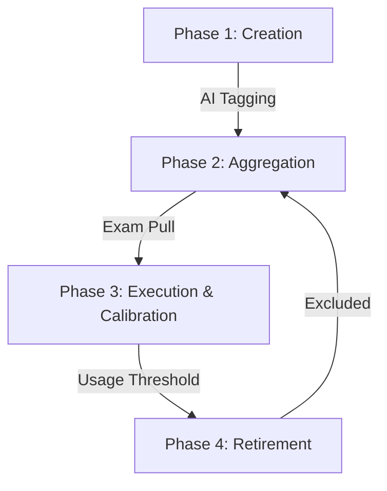

# Table of Specifications (TOS) & Assessment Logic

This document provides a deep dive into the theory, mathematical models, and logic that drive Sentinel's assessment system. It covers the entire lifecycle of a question—from AI-assisted creation to empirical calibration and automated retirement.

---

## 1. Pedagogical Theory: Bloom's Taxonomy

The foundation of Sentinel's TOS is **Bloom’s Taxonomy of Educational Objectives**. This framework allows educators to categorize questions based on the cognitive complexity they require from a student.

### The Six Cognitive Levels

Sentinel utilizes the six levels of the revised Bloom's Taxonomy:

| Level             | Category | Description                                                           | AI Classification Clues        |
| :---------------- | :------- | :-------------------------------------------------------------------- | :----------------------------- |
| **REMEMBERING**   | LOTS     | Retrieving, recognizing, and recalling relevant knowledge.            | Define, List, Identify, Name   |
| **UNDERSTANDING** | LOTS     | Determining the meaning of instructional messages.                    | Summarize, Describe, Interpret |
| **APPLYING**      | LOTS     | Carrying out or using a procedure in a given situation.               | Calculate, Solve, Implement    |
| **ANALYZING**     | HOTS     | Breaking material into constituent parts and detecting relationships. | Compare, Contrast, Attribute   |
| **EVALUATING**    | HOTS     | Making judgments based on criteria and standards.                     | Critique, Judge, Defend        |
| **CREATING**      | HOTS     | Putting elements together to form a novel, coherent whole.            | Design, Propose, Formulate     |

> [!TIP]
> **LOTS** = Lower Order Thinking Skills | **HOTS** = Higher Order Thinking Skills.
> A balanced exam typically targets a mix of both, depending on the course objectives.

---

## 2. The Question Lifecycle

The system manages questions through a four-phase lifecycle.

### Phase 1: Creation (AI-Assisted Classification)

When a source document is uploaded, the **Gemini Orchestrator** analyzes the text to generate questions. During this process, it performs **Automatic Classification**:

1.  **Topic Extraction**: Maps the question to a specific sub-topic found in the text.
2.  **Cognitive Mapping**: Assigns one of the six Bloom's levels based on the question's depth.
3.  **Difficulty Prediction**: Provides an initial `predicted_difficulty` (Easy, Moderate, Hard) based on linguistic complexity and the cognitive level.

### Phase 2: Aggregation (The TOS Matrix)

The **TOS Matrix** is the central dashboard for educators to audit their question bank.

- **Logic**: The system pulls all `ACTIVE` questions and groups them by `Topic` (Y-axis) and `Cognitive Level` (X-axis).
- **Purpose**: Educators use this to ensure **Coverage**. If a critical topic like "Data Structures" only has "Remembering" questions, the educator knows they need to generate more "Applying" or "Analyzing" content.

### Phase 3: Execution & Calibration (IRT Model)

Once students take an exam, the system moves from subjective (AI) predictions to objective (empirical) data using a simplified **Item Response Theory (IRT)** model.

#### The P-Value Formula

Difficulty is defined as the **Item Difficulty Index (P-Value)**:
$$P = \frac{\text{Correct Count}}{\text{Total Attempted}}$$

#### Difficulty Mapping Thresholds

The **Calibration Engine** updates the `actual_difficulty` field based on these empirical results:

- **EASY** ($P \ge 0.85$): Over 85% of students answered correctly.
- **MODERATE** ($0.30 \le P < 0.85$): Balanced difficulty.
- **HARD** ($P < 0.30$): Fewer than 30% of students answered correctly.

### Phase 4: Retirement (Integrity Management)

To prevent "Item Exposure"—where students become too familiar with questions from previous terms—Sentinel implements automated retirement.

1.  **Usage Tracking**: Each time an exam is **Published**, the `usage_count` of all linked questions increments by 1.
2.  **Threshold Check**: The system compares `usage_count` against the `QB_EXPOSURE_LIMIT` (Default: 3).
3.  **Auto-Retirement**: Questions that hit the limit are set to `RETIRED`. They remain in the database for history but are excluded from the "Active" TOS Matrix and future automated exam pulls.

---

## 3. How the System "Pulls" Questions

"Pulling" occurs in two primary ways:

### 1. Matrix Visualization (Data Aggregation)

The backend service [`get-tos-matrix.ts`](file:///Applications/XAMPP/xamppfiles/htdocs/sentinel/app/sentinel-api/src/modules/content/question-bank/data/get-tos-matrix.ts) performs a hierarchical grouping:

- It filters for `status = 'ACTIVE'`.
- It groups results by `topic` and `cognitive_level`.
- It maps these into a structured `TosMatrixSummary` used by the frontend to render the distribution grid.

### 2. Exam Builder Import

In the Exam Builder, educators can "pull" questions from the bank. The logic here uses the TOS metadata:

- **Filtering**: Educators filter the bank by Topic, Bloom's Level, or Difficulty.
- **Selection**: The system provides a preview of the question's history (e.g., "This question was previously HARD").
- **Integration**: Once selected, the question is cloned or linked to the exam, starting its usage tracking cycle.

---

## 4. Summary of Business Logic Flow

1.  **PDF Upload**: AI generates questions + sets initial TOS tags.
2.  **TOS Audit**: Educator reviews the matrix to ensure cognitive balance.
3.  **Exam Publication**: `usage_count` increases; questions are checked for retirement.
4.  **Student Attempt**: Real-world performance data is collected.
5.  **Auto-Calibration**: System recalculates P-Value and updates difficulty tags.
6.  **Retirement**: Questions that have been seen "too much" are moved out of rotation.

---

_Last Updated: 2026-05-07_
_Primary Source Files:_

- [`calibrate-question-difficulty.ts`](file:///Applications/XAMPP/xamppfiles/htdocs/sentinel/app/sentinel-api/src/modules/content/question-bank/services/calibrate-question-difficulty.ts)
- [`get-tos-matrix.ts`](file:///Applications/XAMPP/xamppfiles/htdocs/sentinel/app/sentinel-api/src/modules/content/question-bank/data/get-tos-matrix.ts)
- [`check-exposure-threshold.ts`](file:///Applications/XAMPP/xamppfiles/htdocs/sentinel/app/sentinel-api/src/modules/content/question-bank/services/check-exposure-threshold.ts)
