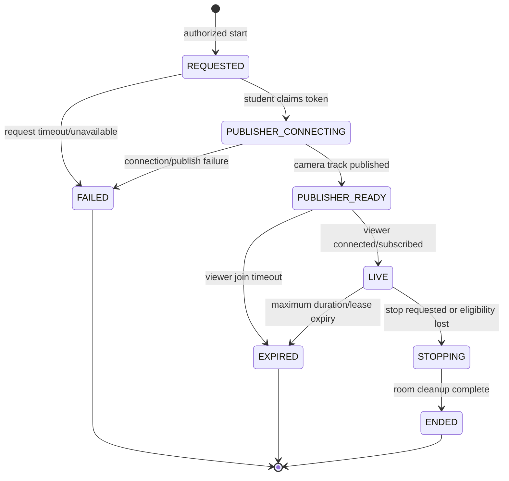

# LiveKit On-Demand Student Camera Integration Context

**Context date:** 2026-07-19  
**Purpose:** Planning input for a later implementation plan  
**Scope:** Student camera-only live inspection from the instructor/proctor monitoring detail page  
**Status:** Strategy recommended; implementation has not started

## 1. Goal and Planning Outcome

Sentinel needs an instructor or assigned proctor to open the monitoring record for one student and inspect that student's live camera during an active exam attempt. A normal examination may have 50-60 students, and several examinations may run at the same time. Sentinel must therefore avoid connecting every student to LiveKit for the full examination.

The later implementation plan should implement an **on-demand, one-student inspection lease**:

- A student continues local MediaPipe camera analysis without joining LiveKit.
- Opening a student monitoring record does not automatically consume LiveKit resources.
- The proctor explicitly starts a live inspection.
- Sentinel authorizes and records that request, signals only the targeted active attempt, and creates a short-lived LiveKit room for that inspection.
- Exactly two standard participants may join the room: the targeted student as a camera-only publisher and one authorized staff viewer as a subscribe-only participant.
- The room and lease are ended when the viewer stops, the attempt stops being eligible, either side times out, or the maximum inspection duration is reached.
- No microphone, recording, screenshots, or video retention are part of this scope.

This is not a way to "trick" LiveKit. It is a legitimate on-demand connection model. LiveKit meters connected participants; a room itself is only a session container. The cost and concurrency reduction comes from keeping students disconnected until a real inspection is requested, not from disguising participants or bypassing billing.

## 2. Recommended Strategy

### Decision

Use **one ephemeral LiveKit room per inspection lease**, not one room per exam and not a permanently reusable room per student.

The room name should be derived from a random lease ID, for example `sentinel-inspection-<opaque-id>`, and must not contain a student name, student number, email address, or raw access token. Create the room explicitly with `maxParticipants: 2`, a short empty timeout, a short departure timeout, and metadata containing only non-sensitive correlation identifiers.

### Why this is the preferred topology

- A two-participant room makes the privacy and capacity boundary explicit.
- Separate rooms prevent one viewer from receiving another student's tracks.
- A random room per lease prevents a stale token from entering a later inspection that happens to target the same student.
- One active lease per attempt prevents multiple proctors from opening parallel camera sessions for the same student.
- A server-owned lease resolves start/stop races and is the source of truth even when a browser closes without sending cleanup.
- LiveKit's `maxParticipants` is a defense-in-depth limit. It is not the primary authorization control.

### Capacity model

For `N` simultaneous inspections:

```text
connected participants = N student publishers + N staff subscribers = 2N
```

If ten exams are active but only one student is being inspected in each exam, LiveKit sees ten isolated rooms and at most twenty connected standard participants. If no student is being inspected, LiveKit sees no connected Sentinel participants even though all students may still be using their cameras locally for MediaPipe.

Do not describe `maxParticipants: 2` as "two participants per exam." The limit applies to each LiveKit room. Under the recommended topology, each room represents one inspection lease for one attempt.

## 3. Current Repository Evidence

### Existing backend seam

The repository contains a partial module at:

- `app/sentinel-api/src/modules/infrastructure/livekit/livekit.service.ts`
- `app/sentinel-api/src/modules/infrastructure/livekit/livekit.dto.ts`
- `app/sentinel-api/src/modules/infrastructure/livekit/livekit.routes.ts`
- `app/sentinel-api/src/modules/infrastructure/livekit/services/aws-ec2.service.ts`

Only `livekit.service.ts` has code. It logs `infrastructure.rtc_token_granted` through `LogsService`; the DTO, routes, and AWS service are empty. The module is not mounted in `app/sentinel-api/src/app.ts`. There are no LiveKit packages in `sentinel-api` or `sentinel-web`, and no LiveKit variables in `app/sentinel-api/.env.example`.

The later plan must treat this as a stub, not as an integrated feature. It should evolve the module specifically for the managed LiveKit service and delete `services/aws-ec2.service.ts`. Sentinel will not start, stop, provision, or maintain AWS EC2 infrastructure for LiveKit. Token issuance, room management, and webhooks will use the managed LiveKit APIs directly.

### Existing instructor monitoring seam

The instructor monitoring flow already has the correct navigation target:

- `app/sentinel-web/src/app/(protected)/(instructor)/exams/[id]/monitoring/page.tsx` lists students and routes to a selected student.
- `app/sentinel-web/src/app/(protected)/(instructor)/exams/[id]/monitoring/[studentId]/page.tsx` loads the selected student's monitoring detail.
- `app/sentinel-web/src/features/exams/monitoring/_components/student-monitoring-detail.tsx` renders `LiveFeedMonitor` beside identity and incident history.
- `app/sentinel-web/src/features/exams/monitoring/_components/live-feed-monitor.tsx` is currently a visual placeholder that always looks live but renders no media.

The implementation should replace the placeholder behavior with explicit states such as `idle`, `requesting`, `waiting_for_student`, `connecting`, `live`, `stopping`, `ended`, and `failed`. It must never show a red `LIVE` badge before a remote camera track is actually subscribed and rendering.

### Existing authorization seam

The monitoring routes are mounted below `/exams`, protected by `authMiddleware`, and use `getMonitoringExamContext()` plus the staff exam-visibility predicates. This is a useful starting point, but live video is more sensitive than reading incident metadata.

The later plan must define a narrower live-video authorization rule. At minimum, the viewer must:

1. be authenticated;
2. hold a dedicated permission such as `examinations:monitor_live_video` (new catalog entry if needed);
3. have staff visibility for the exam;
4. be the exam creator, accepted proctor, assigned section instructor, or another explicitly approved live-monitoring role; and
5. belong to the effective institution scope.

Do not issue a viewer token merely because `assertAssessmentAccess()` accepts the caller's general role.

### Existing student camera seam

The student exam layout already mounts `StudentExamMediaPipeProvider`, which owns a `MediaStream` and keeps it available across the privacy, checkup, lobby, and attempt routes. `useMediapipeCameraRuntime()` consumes that shared stream for local analysis. The attempt page renders a hidden video element for MediaPipe.

The LiveKit publisher should reuse this existing camera source. It must not call a second `getUserMedia()` while the attempt already has a working video track. A practical implementation is to publish a clone of the existing `MediaStreamTrack`, with explicit cleanup behavior, so disconnecting LiveKit cannot stop the original track required by MediaPipe. The implementation plan must include a browser test proving that starting and stopping a LiveKit inspection does not interrupt local MediaPipe analysis or reset camera readiness.

If the shared stream is absent, ended, or camera permission was denied, the student must report an unavailable state. A remote proctor request must not silently bypass the established checkup/privacy flow.

### Existing realtime seam

Sentinel already uses Supabase Realtime for notification/message changes and lobby presence. There is no existing live-inspection broadcast contract. Supabase Realtime can accelerate request delivery, but it must not be the authority for whether a camera may publish.

The recommended split is:

- Sentinel API and the inspection lease record: authority.
- Private Supabase Realtime channel: low-latency wake-up hint.
- Authenticated status fetch or slow recovery poll: reconciliation after a missed event.
- LiveKit: media transport only.

Never place a LiveKit token, API secret, student PII, or permission decision in a broadcast payload.

## 4. End-to-End Target Flow

```mermaid
sequenceDiagram
    autonumber
    actor Proctor
    participant StaffUI as Instructor monitoring UI
    participant API as Sentinel API
    participant DB as Inspection lease store
    participant Signal as Private realtime signal
    participant StudentUI as Student attempt runtime
    participant LK as LiveKit room

    Note over StudentUI: Local camera + MediaPipe active; LiveKit disconnected
    Proctor->>StaffUI: Click Start live view
    StaffUI->>API: POST start inspection for exam + student
    API->>API: Authorize viewer and resolve active owned attempt
    API->>DB: Acquire one active lease for attempt
    API->>LK: Create opaque room, maxParticipants=2
    API->>Signal: Broadcast lease-ready hint to targeted attempt
    API-->>StaffUI: Return lease ID and waiting state

    Signal-->>StudentUI: Inspection requested (lease ID only)
    StudentUI->>API: Claim publisher connection for lease
    API->>API: Verify authenticated student owns active attempt
    API-->>StudentUI: Short-lived camera-only join token + URL
    StudentUI->>LK: Join and publish cloned existing video track
    StudentUI->>API: Acknowledge publisher ready
    API->>DB: Transition REQUESTED -> PUBLISHER_READY

    StaffUI->>API: Fetch viewer connection for ready lease
    API-->>StaffUI: Short-lived subscribe-only join token + URL
    StaffUI->>LK: Join and subscribe to camera track
    LK-->>StaffUI: Remote video frames
    StaffUI->>API: Acknowledge viewing/live state
    API->>DB: Transition PUBLISHER_READY -> LIVE

    Proctor->>StaffUI: Click Stop or leave detail page
    StaffUI->>API: POST stop inspection (idempotent)
    API->>DB: Transition to STOPPING/ENDED
    API->>Signal: Broadcast stop hint
    API->>LK: Remove participants and delete room
    Signal-->>StudentUI: Stop requested
    StudentUI->>LK: Unpublish clone and disconnect
    Note over StudentUI: Original camera + MediaPipe remain active
```

### Start handshake

The cost-conscious ordering is intentional: create the lease first, let the student publisher become ready, and only then connect the staff subscriber. This avoids spending viewer participant minutes while a student is offline, has denied camera access, or cannot establish media.

The staff UI may obtain its viewer token only when the lease is `PUBLISHER_READY`. If implementation simplicity requires returning it at start time, the UI must still wait before connecting and the token TTL must allow for that delay. Generating the token on demand after readiness is safer.

### Stop and crash recovery

Frontend cleanup alone is insufficient. The following conditions must independently end the lease:

- viewer clicks Stop;
- viewer navigates away or closes the detail view;
- student submits, becomes locked/closed/superseded, or leaves the active attempt;
- maximum inspection duration expires;
- publisher never becomes ready within the request timeout;
- viewer never joins after publisher readiness;
- LiveKit webhook reports participant departure, connection abort, track unpublish, or room finish;
- a periodic backend reconciler finds an expired non-terminal lease.

Stop operations must be idempotent. The backend should tolerate duplicate UI cleanup, webhook delivery, and timeout cleanup without creating conflicting audit records.

## 5. Proposed Lease State Machine



Use explicit terminal reasons, for example:

- `VIEWER_STOPPED`
- `VIEWER_LEFT`
- `STUDENT_LEFT`
- `ATTEMPT_INELIGIBLE`
- `REQUEST_TIMEOUT`
- `PUBLISH_FAILED`
- `VIEWER_JOIN_TIMEOUT`
- `MAX_DURATION_REACHED`
- `ROOM_CAPACITY_REACHED`
- `PROVIDER_ERROR`

## 6. Server-Side Contracts the Plan Must Define

Exact route names may be adjusted to repository conventions, but the plan should cover equivalent operations.

### Staff operations

- `POST /exams/:examId/monitoring/students/:studentId/live-inspections`
    - Authorize viewer.
    - Resolve the student's latest eligible active attempt and use the canonical `attemptId`, not only the route's user/student ID.
    - Atomically acquire a lease or return `409 INSPECTION_ALREADY_ACTIVE` with safe current-session metadata.
    - Create the LiveKit room with a two-participant limit.
    - Return lease status and expiry, but no publisher credential.
- `GET /exams/:examId/monitoring/live-inspections/:leaseId`
    - Return sanitized status for polling/recovery.
- `POST /exams/:examId/monitoring/live-inspections/:leaseId/viewer-connection`
    - Reauthorize the viewer and lease ownership.
    - Issue a short-lived subscribe-only credential only after publisher readiness.
- `POST /exams/:examId/monitoring/live-inspections/:leaseId/stop`
    - End the lease idempotently and clean up the provider room.

### Student operations

- `GET /examination/flow/live-inspections/active?sessionId=:sessionId`
    - Verify the authenticated student owns the active attempt.
    - Return only the current directive and lease ID.
- `POST /examination/flow/live-inspections/:leaseId/publisher-connection`
    - Recheck attempt eligibility and lease freshness.
    - Issue a short-lived publish-camera-only credential.
- `POST /examination/flow/live-inspections/:leaseId/publisher-ready`
    - Record readiness using expected lease version/state.
- `POST /examination/flow/live-inspections/:leaseId/publisher-failure`
    - Store a bounded error code, not raw browser/device details.

### Provider webhook

- `POST /infrastructure/livekit/webhooks`
    - Must verify the LiveKit webhook signature against the raw request body.
    - Must deduplicate by webhook event ID.
    - Must map only known opaque room/participant identities back to an inspection lease.
    - Must not trust webhook payload fields without signature verification.

The later plan should add shared Zod schemas and service-client types so frontend, API runtime validation, and OpenAPI remain aligned.

## 7. Suggested Persistence Contract

A small database table is recommended because it provides atomic lease acquisition, crash recovery, support diagnostics, and auditable duration without retaining media. A working name is `live_monitoring_sessions` or `live_inspection_leases`.

Suggested fields:

| Field                       | Purpose                                           |
| --------------------------- | ------------------------------------------------- |
| `lease_id`                  | Opaque UUID primary key and room correlation ID   |
| `exam_id`                   | Exam scope                                        |
| `attempt_id`                | Canonical targeted attempt                        |
| `student_user_id`           | Ownership check; do not put this in the room name |
| `viewer_user_id`            | Authorized staff member who owns the lease        |
| `institution_id`            | Tenant scope                                      |
| `provider_room_name`        | Opaque unique LiveKit room name                   |
| `state`                     | Lease state machine value                         |
| `version`                   | Optimistic transition/version guard               |
| `requested_at`              | Request timestamp                                 |
| `publisher_ready_at`        | Camera track readiness timestamp                  |
| `viewer_joined_at`          | Start of actual inspection                        |
| `ended_at`                  | Terminal timestamp                                |
| `expires_at`                | Hard server-controlled expiry                     |
| `end_reason`                | Bounded terminal reason code                      |
| `last_error_code`           | Bounded operational code; no secrets or raw SDP   |
| `created_at` / `updated_at` | Operational traceability                          |

Required invariants:

- At most one non-terminal lease for an attempt.
- A lease belongs to one viewer and cannot be adopted by another viewer unless a deliberate takeover contract is designed.
- Non-terminal transitions use compare-and-set state/version checks.
- Terminal cleanup is idempotent.
- Expired leases cannot mint new tokens.
- Room names are never reused.

A partial unique database index over active states is preferable to a read-then-insert check. If the team chooses Redis for short-lived coordination, the implementation plan must still specify atomic acquisition, TTL behavior, a database/audit trail, local development behavior when Redis is absent, and recovery after Redis restarts.

## 8. LiveKit Security and Media Grants

All access tokens must be generated by `sentinel-api` with `livekit-server-sdk`. The API key and secret must never enter a Next.js public environment variable or API response.

### Student publisher grant

```ts
{
    roomJoin: true,
    room: opaqueRoomName,
    canPublish: true,
    canPublishSources: ['camera'],
    canSubscribe: false,
    canPublishData: false,
}
```

### Staff viewer grant

```ts
{
    roomJoin: true,
    room: opaqueRoomName,
    canPublish: false,
    canSubscribe: true,
    canPublishData: false,
}
```

Additional requirements:

- Use distinct opaque participant identities for publisher and viewer.
- Keep token TTL short and never persist tokens in the database, logs, analytics, query strings, local storage, or Supabase payloads.
- Do not grant room admin, room create, room list, recording, ingress, egress, screen-share, microphone, or metadata-update capabilities to browser clients.
- Explicitly create the room server-side with `maxParticipants: 2`; do not rely on room auto-creation defaults.
- Set `autoSubscribe: false` for the viewer and subscribe only to the expected camera publication from the expected publisher identity.
- Reject extra or unexpected tracks even though the token already restricts publish sources.
- Do not mark either browser participant as hidden; hidden participants can complicate capacity/accounting expectations.
- Backend lease checks, unique room names, room deletion, provider-side participant removal, and short token TTL are required even though the managed LiveKit service supports permission revocation.

## 9. Student Runtime Integration Details

The later implementation plan should introduce a focused client controller/hook under the student exam flow rather than embedding LiveKit logic directly in `AttemptView`.

Responsibilities should include:

- subscribe to the private per-attempt wake-up channel;
- reconcile the authoritative active directive after reconnect or a missed signal;
- claim the publisher token only while the attempt is active and camera monitoring is allowed;
- locate the existing live video track from `StudentExamMediaPipeProvider`;
- clone and publish only that track;
- keep the original MediaPipe stream alive when unpublishing/disconnecting;
- acknowledge ready/failure states;
- stop on lease change, terminal attempt state, submission, track end, timeout, or unmount;
- guard every async callback with the current lease ID so a late response cannot revive an ended inspection.

The hook must not expose the video token to unrelated components. It should expose only a safe state such as `idle`, `requested`, `publishing`, `live`, `stopping`, or `error`, plus a bounded error code for student-facing status if needed.

## 10. Instructor UI Contract

`LiveFeedMonitor` should become a real stateful component connected through a feature hook and shared service client.

Minimum UX behavior:

- Default state says no live connection exists and offers **Start live view**.
- Starting a view clearly says the student is being contacted; it does not display a false `LIVE` badge.
- A configurable request timeout produces a useful unavailable/retry state.
- `LIVE` appears only after the expected remote camera track is attached and playing.
- The component shows connection/reconnection quality without exposing provider internals to the user.
- The viewer can always stop the inspection.
- Navigation and unmount send best-effort stop, while backend expiry remains authoritative.
- A `409` active-lease response explains that the student is already being viewed; it does not silently create a third participant.
- Camera unavailable, student offline, attempt ended, capacity reached, permission denied, and provider unavailable have distinct messages.
- Video has no audio control because audio is out of scope.
- Autoplay uses a video-only track; `playsInline` is required.
- Responsive and accessibility tests cover keyboard controls, focus, labels, status announcements, reduced motion, and a non-video fallback.

The monitoring list should not render dozens of hidden LiveKit connections. Only the selected detail view may start a lease, and only after explicit user action.

## 11. Realtime Signaling Strategy

Recommended channel: a private, attempt-scoped channel such as `exam-attempt:<attemptId>:live-inspection`. The event should contain only:

```json
{
    "type": "LIVE_INSPECTION_CHANGED",
    "leaseId": "opaque-uuid",
    "revision": 3
}
```

On receipt, the student fetches the authoritative directive from Sentinel API. This prevents a forged or stale broadcast from turning on publication.

The plan must specify:

- how private channel membership is authorized;
- how the API sends the event;
- channel cleanup on route changes and session termination;
- reconnect/resubscribe behavior;
- a slow reconciliation path for dropped events;
- event revision or lease ID checks to reject stale start/stop ordering;
- test doubles for Supabase Realtime so the lifecycle is deterministic in Vitest.

Do not rely only on `ParticipantDisconnected` in the student browser. The student may connect before the viewer, and temporary LiveKit reconnection events should not immediately kill a valid lease. Server lease state and deadlines decide whether to continue.

## 12. Cost and Capacity Model

LiveKit currently defines a WebRTC participant minute as one connected end user for one minute, with individual usage rounded to the documented minimum increment. Therefore a completed inspection of duration `d` minutes normally consumes approximately:

```text
publisher participant minutes  = ceil(d) for the student
subscriber participant minutes = ceil(d) for the viewer
total participant minutes      = approximately 2 * ceil(d)
```

Connection setup/wait time and reconnection can increase this amount. Downstream media transfer is a separate metered resource. The later implementation plan must use current LiveKit pricing/quota documentation and the project's actual plan rather than freezing free-tier numbers in code or acceptance criteria.

Load-test at least these scenarios:

- 60 active student attempts, zero inspections: zero LiveKit participants;
- one inspection: one room, two participants at live state;
- 10 simultaneous inspections across 10 exams: 10 rooms, at most 20 participants;
- simultaneous start requests for the same attempt: one lease succeeds, the rest receive a conflict;
- provider participant limit reached: no retry storm and a clear bounded error;
- request/publisher/viewer timeouts: room and lease are cleaned without orphaned connections.

Operational thresholds should be configuration, not hard-coded UI assumptions: request timeout, viewer join timeout, maximum inspection duration, token TTL, empty timeout, departure timeout, and global/per-institution concurrent inspection caps.

## 13. Managed LiveKit Service Only

Use the managed LiveKit service for development, staging, and production. Self-hosted LiveKit and AWS EC2 are explicitly out of scope and are not a future requirement for this integration.

Reasons:

- The managed service already supplies the realtime media infrastructure, TURN coverage, room APIs, webhooks, operational scaling, and service monitoring required by this feature.
- Removing EC2 lifecycle logic avoids cold starts, infrastructure credentials, instance-state races, firewall/TLS maintenance, patching, and a second operational failure domain.
- Sentinel should own application authorization, inspection leases, audit records, and UI state—not LiveKit server infrastructure.

Delete the empty `app/sentinel-api/src/modules/infrastructure/livekit/services/aws-ec2.service.ts` during implementation and do not add AWS SDK dependencies or AWS credentials for this feature. Keep domain authorization and lease logic separate from the LiveKit SDK for testability, but do not build a speculative multi-provider or self-hosting abstraction.

Expected server-only configuration:

- `LIVEKIT_URL`
- `LIVEKIT_API_KEY`
- `LIVEKIT_API_SECRET`
- `LIVEKIT_WEBHOOK_API_KEY` only if the webhook verifier requires a separately named key; otherwise reuse the documented project key safely
- inspection request timeout
- publisher-ready/viewer-join timeout
- maximum inspection duration
- token TTL
- global and per-institution active-inspection caps

Only the websocket URL may be returned to an authorized client alongside a token. Secrets remain server-only. Update `.env.example` with placeholders and startup validation before enabling the feature.

## 14. Privacy, Consent, and Audit Boundaries

Before rollout, product/legal owners must approve the exact disclosure and institutional policy. The technical implementation should enforce these minimum boundaries:

- The privacy/checkup flow states that an authorized proctor may view the camera live during an active attempt.
- Camera inspection is available only when the exam configuration requires/allows camera monitoring and the student completed the device/privacy gate.
- No microphone track is captured or published by this feature.
- No Egress, recording, screenshots, thumbnails, frame storage, or raw video telemetry is enabled.
- The UI shows a visible student-side indicator while live publication is active unless policy explicitly requires another approved treatment.
- Audit metadata records who requested/viewed, which attempt was targeted, start/ready/end timestamps, duration, and terminal reason.
- Audit logs exclude tokens, API secrets, SDP/ICE payloads, IP addresses unless already covered by an approved security policy, video frames, image data, face landmarks, and student-facing content.
- Retention applies to lease/audit metadata only and follows Sentinel's approved audit retention policy.

Suggested audit actions:

- `infrastructure.live_inspection_requested`
- `infrastructure.rtc_token_granted` with `role: publisher | viewer`
- `infrastructure.live_inspection_publisher_ready`
- `infrastructure.live_inspection_started`
- `infrastructure.live_inspection_ended`
- `infrastructure.live_inspection_failed`

Do not log one event for every video frame or connection-quality sample.

## 15. Failure Handling and Observability

The implementation plan should define bounded internal error codes and counters for:

- authorization denial;
- no active/eligible attempt;
- camera stream unavailable;
- signal delivery/reconciliation delay;
- room creation failure;
- publisher token/viewer token issuance failure;
- publisher connect or track publish failure;
- viewer connect or subscription failure;
- participant capacity conflict;
- webhook verification/deduplication failure;
- cleanup/reconciler failure;
- lease duration and time-to-first-frame percentiles.

Metrics should answer:

- How many inspection requests become live?
- How long from request to publisher ready and first rendered frame?
- How many rooms/participants are active now by institution?
- How many leases ended cleanly versus expired/reconciled?
- What are participant minutes and downstream GB per completed inspection?
- Are repeated failures concentrated by browser/network/institution?

Logs and metrics must use lease/attempt IDs and bounded codes, not raw tokens or media data.

## 16. Test Strategy Required by the Later Plan

### Unit and contract tests

- Shared schemas accept valid start/status/connection/stop contracts and reject malformed IDs/states.
- Grant builder produces camera-only publisher and subscribe-only viewer permissions.
- Room builder always sets an opaque name and `maxParticipants: 2`.
- Authorization covers allowed assignments and denies same-institution but unrelated staff.
- Attempt ownership/eligibility denies completed, locked, closed, superseded, or mismatched attempts.
- State transitions and compare-and-set conflicts are deterministic.
- Token TTL and terminal lease rules prevent token issuance after expiry/end.
- Webhook signature verification and event-ID dedupe are tested.
- Cleanup is idempotent.

### Frontend tests

- Student responds only to an authoritative directive for its current attempt.
- Stale realtime events and late async responses cannot restart an ended lease.
- Existing camera track is reused/cloned and no second `getUserMedia()` call occurs.
- LiveKit disconnect/unpublish does not end the MediaPipe source track.
- No microphone track is published.
- Instructor does not connect before publisher readiness under the chosen handshake.
- `LIVE` appears only after the expected track is attached.
- Stop, navigation, timeout, conflict, offline student, denied permission, and provider errors render correctly.

### Integration and manual verification

- Two authenticated browser sessions complete the full request-to-first-frame-to-stop flow.
- A third client cannot join a two-participant room.
- An unrelated instructor cannot create, view, poll, stop, or mint credentials for a lease.
- The student cannot obtain a token for another student's attempt or a terminal lease.
- Refresh/reconnect on both sides reconciles without duplicate rooms.
- Submitting/locking/closing the attempt stops publication promptly.
- Browser coverage includes Chromium, Firefox, and Safari/WebKit on representative campus networks.
- Restricted networks validate TURN fallback and produce useful diagnostics when media still cannot connect.
- No audio is audible, no recording is created, and logs contain no tokens/media.

## 17. Rollout and Rollback Strategy

Use layered feature controls:

1. global kill switch;
2. institution allowlist;
3. exam configuration eligibility;
4. dedicated viewer permission;
5. global and per-institution concurrency caps.

Suggested rollout:

- local two-browser integration against a development LiveKit project;
- staging with synthetic accounts and webhook/reconciler verification;
- one internal institution and a small concurrent-inspection cap;
- observe first-frame latency, failure codes, minutes, and downstream transfer;
- expand only after privacy approval and capacity evidence.

Rollback disables new lease creation through the server-side feature flag, sends stop for all active leases, deletes provider rooms, and leaves local MediaPipe monitoring unchanged. Because video is not persisted, rollback must not require a media-data migration.

## 18. Expected Affected Areas for Planning

The later implementation plan should inspect and likely include:

### API and database

- `app/sentinel-api/src/modules/infrastructure/livekit/**`
- `app/sentinel-api/src/modules/examination/monitoring/**`
- `app/sentinel-api/src/modules/examination/flow/**`
- `app/sentinel-api/src/modules/security/**` for a dedicated permission/feature control
- `app/sentinel-api/src/app.ts` or the owning route registration boundary
- `app/sentinel-api/.env.example`
- `app/sentinel-api/package.json`
- `packages/db/prisma/schema.prisma`
- a new Prisma migration for the lease table/index if database persistence is chosen

### Shared contracts, services, and hooks

- `packages/shared/src/schema/exams/monitoring-schema.ts`
- `packages/shared/src/constants/exams/exam-constants.ts`
- `packages/services/src/api/exams/monitoring.ts`
- `packages/services/src/api/exams/types.ts`
- `packages/hooks/src/query/exams/**`

### Student and instructor UI

- `app/sentinel-web/src/app/(protected)/student/exam/[id]/layout.tsx`
- `app/sentinel-web/src/app/(protected)/student/exam/[id]/_components/student-exam-mediapipe-provider.tsx`
- `app/sentinel-web/src/app/(protected)/student/exam/[id]/_hooks/use-attempt-mediapipe-monitoring/**`
- a new student live-inspection controller/hook near the exam runtime
- `app/sentinel-web/src/app/(protected)/(instructor)/exams/[id]/monitoring/[studentId]/page.tsx`
- `app/sentinel-web/src/features/exams/monitoring/_components/student-monitoring-detail.tsx`
- `app/sentinel-web/src/features/exams/monitoring/_components/live-feed-monitor.tsx`
- `app/sentinel-web/package.json`

The plan should prefer feature-local tests and shared contracts rather than duplicating room/token shapes in API and frontend workspaces.

The API scope above includes deleting `app/sentinel-api/src/modules/infrastructure/livekit/services/aws-ec2.service.ts`; no replacement EC2 service or AWS configuration should be introduced.

## 19. Decisions the Implementation Plan Must Lock Down

These are not reasons to block context creation, but the later plan must resolve them explicitly:

1. Exact staff roles/relationships allowed to view live video, especially administrator and shared-exam cases.
2. Whether one viewer may inspect only one student at a time, in addition to one active viewer per attempt.
3. Request timeout, viewer-join timeout, maximum inspection duration, and token TTL.
4. Whether the student sees a persistent live-view indicator and the approved disclosure copy.
5. Database table versus Redis-backed active lease, including recovery/audit guarantees.
6. Supabase private-channel authorization design and the recovery polling interval.
7. Whether a camera-optional exam may offer live inspection; the safe default is no.
8. Institution/global concurrency caps below the provider quota.
9. Approved browsers, campus network test sites, and acceptable first-frame latency.
10. Audit metadata retention and who may review live-inspection history.

## 20. Definition of Done for the Future Implementation

The integration is complete only when:

- no LiveKit participant is connected for an uninspected student;
- an authorized staff member can explicitly request one active student's camera and receive the first frame within the agreed SLO;
- the room admits only the expected camera publisher and one subscriber;
- no microphone or recording path exists;
- unauthorized viewers and mismatched students cannot mint or reuse credentials;
- duplicate/racing requests produce one authoritative lease;
- stop, attempt termination, timeout, disconnect, webhook, and reconciliation paths clean up rooms and clients;
- MediaPipe continues before, during, and after live inspection using the original camera stream;
- UI state reflects real connection/track state and never falsely claims `LIVE`;
- audit/metrics provide duration and failure evidence without tokens, PII-rich payloads, or media;
- load tests prove zero idle LiveKit participants and the expected `2N` cap for `N` simultaneous live inspections;
- the feature can be disabled without affecting exam completion or local proctoring telemetry.

## 21. Official LiveKit References

Use these current official references when writing the implementation plan and re-check plan limits/pricing at implementation time:

- [Tokens and grants](https://docs.livekit.io/home/server/generating-tokens/) — room-scoped JWTs, `canPublish`, `canPublishSources`, `canSubscribe`, TTL, and permission revocation behavior.
- [Room Service API](https://docs.livekit.io/reference/other/roomservice-api/) — explicit room creation, `max_participants`, empty/departure timeouts, participant removal, and room deletion.
- [Room management](https://docs.livekit.io/intro/basics/rooms-participants-tracks/rooms/) — rooms as session containers and automatic room lifecycle.
- [Tracks](https://docs.livekit.io/intro/basics/rooms-participants-tracks/tracks/) — track publication/subscription behavior.
- [Selective subscriptions](https://docs.livekit.io/transport/media/subscribe/) — disabling automatic subscription and subscribing only to expected tracks.
- [Webhooks and events](https://docs.livekit.io/intro/basics/rooms-participants-tracks/webhooks-events/) — participant, track, abort, and room lifecycle events.
- [Cloud quotas and limits](https://docs.livekit.io/deploy/admin/quotas-and-limits/) — current connected-participant limits and metered-resource definitions.
- [Cloud billing](https://docs.livekit.io/deploy/admin/billing/) — participant-minute and transfer metering, including rounding behavior.
- [LiveKit Cloud](https://docs.livekit.io/intro/cloud/) — managed service capabilities and administration guidance.

Related repository note: `docs/capstone/livekit-monitoring.md` contains the earlier high-level idea. Where it conflicts with this document, use this document for later planning because it adds server-authoritative leases, narrower authorization, race handling, lifecycle cleanup, existing-camera reuse, and current repository evidence.
