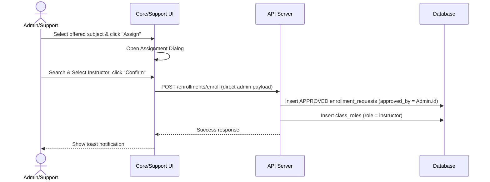

# System Design & Technical Context: Administrator Assign Subject to Instructor

> **Context Scope**: Detail the requirements, database schemas, API contracts, frontend design, and permission configuration for enabling administrators and support roles in `sentinel-core` and `sentinel-support` to assign offered subjects directly to instructors.

---

## 1. Requirement & Goal Overview

The goal is to allow authorized administrators and support roles to directly assign offered subjects to instructors. 

### Key Rules & Requirements

1. **Role Authorization**:
   - Only **Support**, **Admin** (admin), and **Superadmin** (superadmin) roles are authorized to assign subjects.
   - The support role operates globally/institutionally, while admin and superadmin roles operate within their configured academic scope.

2. **Source & Trigger (Offered Subjects List)**:
   - Direct assignments are triggered from the **Offered Subjects** page (`/subjects/offered`).
   - Any subject currently listed as offered can be assigned to an instructor.
   - The assignment trigger must be implemented in two places on the Offered Subjects table:
     - **Row Action Column**: An "Assign" button/icon on each subject offering row.
     - **Floating Action Bar**: An "Assign to Instructor" button shown when one or more subject offerings are selected.

3. **Academic & Department Scope**:
   - Assignments must occur within the same institution/branch.
   - **Department-Agnostic Assignment**: An administrator/support user can assign any offered subject to any instructor in the institution, regardless of their home department.
   *Example*: If a subject under the `SECA` department is offered, it can be assigned to an instructor from `SECA` or `SASE` department within that institution.

4. **Instructor-Facing Visibility & Approval Tracking**:
   - Assigned subjects must appear on the instructor's **Subject List** page (`/subjects` in `sentinel-web`).
   - The instructor's list page includes an **"Approved By"** column.
   - When a subject is assigned by an administrator or support user, this column must display the name of the user who assigned it (the "approver").

---

## 2. Database Mappings & Assignment Flow

When an administrator or support user assigns an offered subject (representing a `subject_offering_id` containing sections / `class_groups`) to an instructor, the system resolves this assignment:

1. **Enrollment Request Mapping**:
   - The backend creates `APPROVED` status records in the `enrollment_requests` table linking the instructor (`user_id`) to the corresponding `class_group_id` records of the offering.
   - The `approved_by` field in `enrollment_requests` is populated with the `user_id` of the assigning administrator/support user.

2. **Class Role Mapping**:
   - A corresponding record is created in the `class_roles` table with `role_name = 'instructor'`, granting the instructor immediate access to teach the sections of that offered subject.



---

## 3. Database Schema Reference

The tables in [schema.prisma](file:///Applications/XAMPP/xamppfiles/htdocs/sentinel/packages/db/prisma/schema.prisma) governing this flow are:

### Enrollment Requests (`enrollment_requests`)
Tracks the assignment state and who approved/assigned the subject.
```prisma
model enrollment_requests {
  request_id       String            @id @default(dbgenerated("gen_random_uuid()")) @db.Uuid
  class_group_id   String            @db.Uuid
  user_id          String            @db.Uuid
  status           request_status    @default(PENDING)
  approved_by      String?           @db.Uuid
  created_at       DateTime?         @default(now()) @db.Timestamptz(6)
  updated_at       DateTime?         @db.Timestamptz(6)
  
  users_approvedTousers  users?      @relation("enrollment_requests_approved_byTousers", fields: [approved_by], references: [id], onDelete: NoAction, onUpdate: NoAction)
  users_requestsTousers  users       @relation("enrollment_requests_user_idTousers", fields: [user_id], references: [id], onDelete: Cascade, onUpdate: NoAction)
}
```

### Class Roles (`class_roles`)
Grants teaching access to the instructor for the classroom.
```prisma
model class_roles {
  class_role_id  String    @id @default(dbgenerated("gen_random_uuid()")) @db.Uuid
  class_group_id String    @db.Uuid
  user_id        String    @db.Uuid
  role_id        String    @db.Uuid
  assigned_at    DateTime? @default(now()) @db.Timestamptz(6)
}
```

---

## 4. API & Query Layer Details

### Instructor Enrolled Subjects Endpoint
The instructor's subject list page calls the `GET /enrollments/enrolled` route handler.

Inside [get-enrolled-subjects.ts](file:///Applications/XAMPP/xamppfiles/htdocs/sentinel/app/sentinel-api/src/modules/identity/enrollments/data/get-enrolled-subjects.ts), the query resolves the approver's identity via `approver_profiles`:
```typescript
    let query = dbClient
        .selectFrom('class_roles')
        .innerJoin('class_groups', 'class_groups.class_group_id', 'class_roles.class_group_id')
        ...
        .leftJoin('enrollment_requests', (join) =>
            join
                .onRef('enrollment_requests.class_group_id', '=', 'class_roles.class_group_id')
                .onRef('enrollment_requests.user_id', '=', 'class_roles.user_id')
                .on('enrollment_requests.status', '=', 'APPROVED'),
        )
        .leftJoin('user_profiles as approver_profiles', (join) =>
            join.onRef('approver_profiles.user_id', '=', 'enrollment_requests.approved_by'),
        )
        .select([
            ...
            sql<string | null>`MAX(NULLIF(TRIM(concat_ws(' ', approver_profiles.first_name, approver_profiles.last_name)), ''))`.as(
                'approved_by_name',
            ),
        ]);
```
This maps to the Zod schema property `approved_by_name` inside `instructorEnrolledSubjectSchema` (defined in `packages/shared/src/schema/subjects/enrollment-request-schema.ts`).
In the instructor UI, the `useSubjectsList` hook maps this to the `approved_by` display field.

---

## 5. UI Implementation Details

### Offered Subjects Table (`sentinel-core` & `sentinel-support`)
To add the assignment capability on `/subjects/offered`:

1. **Row Action Column**:
   - In `offered-subjects-list` or its actions cell component, add an **Assign** button.
   - This button opens the `AssignSubjectToInstructorDialog` passing the selected `subjectOfferingId`.

2. **Floating Action Bar**:
   - Displayed when one or more checkboxes are selected.
   - Add an **Assign to Instructor** button.
   - Opens the assignment dialog with an array of selected `subjectOfferingIds`.

3. **Assignment Dialog Component (`AssignSubjectToInstructorDialog`)**:
   - Contains a search bar to search for instructors by name or employee number (filtered inside the same institution).
   - Lists matching instructors with their department.
   - Upon confirming, calls the API mutation to enroll the instructor in the selected offered subjects (automatically approving it with the active admin/support user ID).

---

## 6. Permissions & Roles Registry Configuration

### Role Mappings Update
In [permissions.ts](file:///Applications/XAMPP/xamppfiles/htdocs/sentinel/packages/shared/src/constants/permissions.ts), we must configure access control so that the `support`, `admin`, and `superadmin` roles have permissions to manage offered-subject approvals and assignments:

- **Support**:
  Ensure `'subject_requests:approve'` and `'subject_offerings:update'` are present in the `permissionKeys` array of the `support` blueprint block.
- **Superadmin**:
  Ensure `'subject_requests:approve'` is present in `permissionKeys`.
- **Admin**:
  Ensure `'subject_requests:approve'` is present in `permissionKeys`.

### Automatic Permissions Page Sync
The backend API has a system synchronization listener defined in [sync-system-permissions.ts](file:///Applications/XAMPP/xamppfiles/htdocs/sentinel/app/sentinel-api/src/modules/security/permission/data/sync-system-permissions.ts).
- When permissions are queried by the support dashboard, it automatically reads `ALL_PERMISSIONS` from the shared package constants and upserts/prunes the `rbac_permissions` database table.
- This ensures any new or modified system permissions are dynamically displayed on the **Permission Registry** page under `sentinel-support` `/control/permissions`.

---

## 7. Verification Plan

### Automated Tests
- Ensure `getEnrolledSubjectsData` returns the correct `approved_by_name` when a subject is assigned.
- Test permission checks on the Hono backend for the roles.

### Manual Verification
1. Log in as a **Support** user or **Administrator**, navigate to **Offered Subjects**.
2. Click **Assign** on a subject row, select an instructor, and confirm the assignment.
3. Select multiple subjects, click **Assign to Instructor** in the floating action bar, and assign them in bulk.
4. Log in as the assigned **Instructor** on `sentinel-web`.
5. Navigate to the **Subject List** page.
6. Verify that the assigned subjects are listed, and the **Approved By** column correctly shows the name of the administrator/support user who performed the assignment.