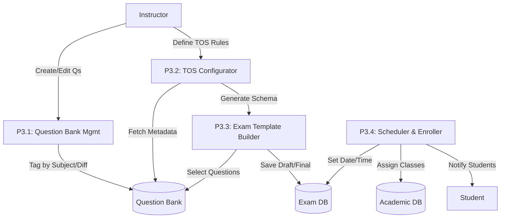
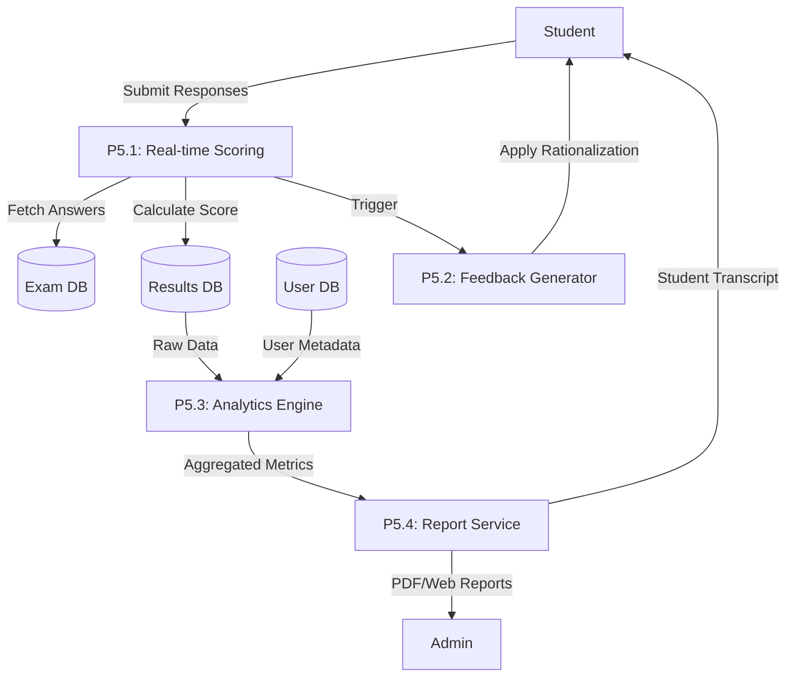
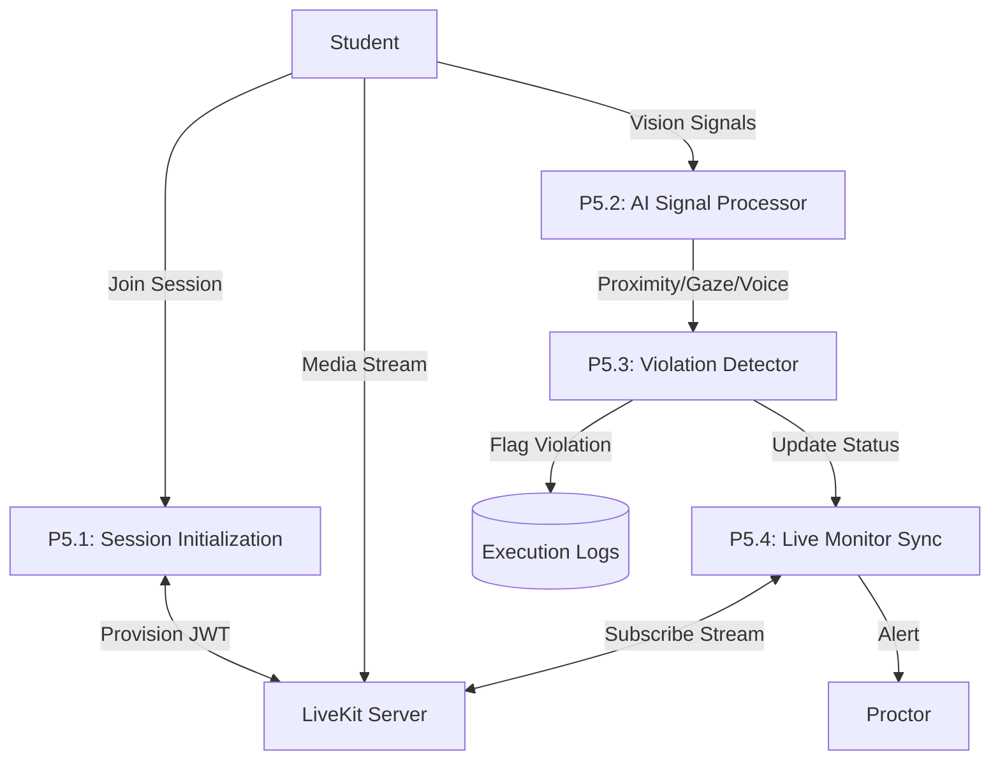
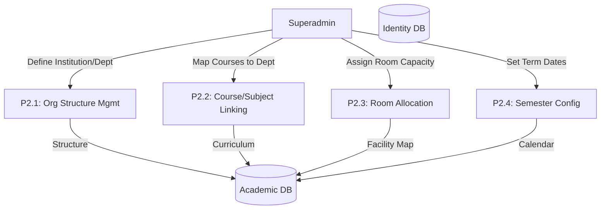

# Goal

- To create a data flow diagram for the sentinel

## Deliverables

## Diagrams syntax

- [ ] DFD Level 1 - Mermaid.js code
- [ ] DFD Level 2 - Mermaid.js code

## DFD Level 0

- This diagram should show the overall system and its main processes and data stores

## DFD Level 1: End-to-End System Architecture Overview

```mermaid
graph TB
    %% External Entities
    ST[Student]
    INS[Instructor]
    ADM[Admin/Superadmin]
    SUP[Support/Proctor]
    EXT_AUTH[Supabase Auth]
    EXT_AI[AI Engine - Gemini]
    EXT_LIVE[LiveKit Server]

    %% Processes
    subgraph P1[P1: Identity & Access Management]
        direction TB
        P1_1[Auth & Enrollment]
        P1_2[Role-Based Access]
    end

    subgraph P2[P2: Academic Infrastructure]
        direction TB
        P2_1[Institution & Hierarchy]
        P2_2[Course/Subject Mapping]
        P2_3[Room & Schedule Mgmt]
    end

    subgraph P3[P3: Content & Question Engineering]
        direction TB
        P3_1[AI Question Generation]
        P3_2[Question Bank & Versioning]
    end

    subgraph P4[P4: Examination Lifecycle]
        direction TB
        P4_1[TOS & Template Engine]
        P4_2[Exam Builder & Validation]
    end

    subgraph P5[P5: Real-time Execution & AI Proctoring]
        direction TB
        P5_1[Live Stream Orchestration]
        P5_2[AI Vision Proctoring]
        P5_3[State Synchronization]
    end

    subgraph P6[P6: Assessment & Intelligent Review]
        direction TB
        P6_1[Automated Scoring]
        P6_2[AI Feedback & Rationalization]
        P6_3[Analytics & Reporting]
    end

    subgraph P7[P7: System Intelligence & Support]
        direction TB
        P7_1[Telemetry Ingestion]
        P7_2[Audit Logging]
        P7_3[Omnichannel Messaging]
    end

    %% Data Stores
    D1[(Identity DB)]
    D2[(Academic DB)]
    D3[(Content & QBank)]
    D4[(Exam Registry)]
    D5[(Execution Logs)]
    D6[(Assessment DB)]
    D7[(Telemetry & Audit)]

    %% Flows - Identity & Access
    ST -->|Login| P1
    P1 <-->|Verify| EXT_AUTH
    P1 <-->|Sync| D1

    %% Flows - Academic & Content
    ADM -->|Manage System| P2
    P2 <-->|Store Config| D2
    INS -->|Create Content| P3
    P3 <-->|Fetch/Enrich| EXT_AI
    P3 <-->|Archive| D3

    %% Flows - Exam Lifecycle
    INS -->|Configure TOS| P4
    P4 <-->|Pull Metadata| D3
    P4 <-->|Register Exam| D4

    %% Flows - Real-time Execution
    ST -->|Connect Stream| P5
    P5 <-->|Exchange Signal| EXT_LIVE
    P5 -->|AI Signals| P5_2
    P5 <-->|Persist State| D5
    SUP -->|Live Monitor| P5_1

    %% Flows - Assessment
    P5 -->|Trigger Finalize| P6
    P6 <-->|Fetch Logic| D4
    P6 <-->|Generate Feedback| EXT_AI
    P6 -->|Write Results| D6
    ST & INS & ADM -->|View Reports| P6

    %% Flows - Support & Audit
    P1 & P2 & P3 & P4 & P5 & P6 -->|Telemetry| P7
    P7 -->|Index| D7
    SUP -->|Support Workflow| P7_3
```

## DFD Level 2: Examination Lifecycle (Decomposition of P3)

## DFD Level 2: Assessment & Grading (Decomposition of P5)

## DFD Level 2: Real-time Execution & AI Proctoring (Decomposition of P5)

## DFD Level 2: Academic Structure (Decomposition of P2)

## Guidelines

- Use the correct syntax for mermaid.js
- Use the correct syntax for data flow diagrams
- Ensure to follow the golden standard for data flow diagrams
