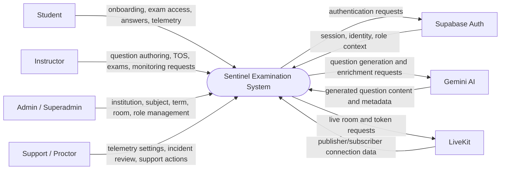
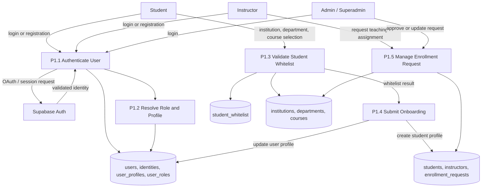
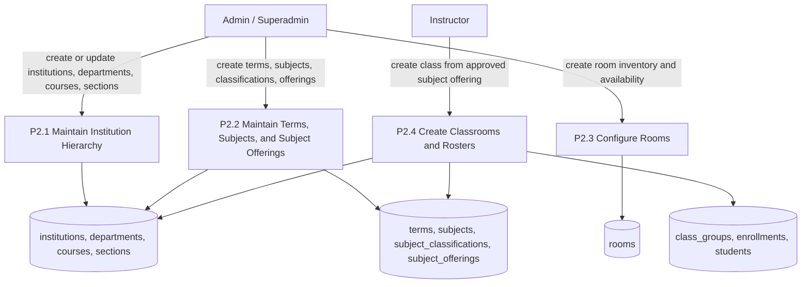
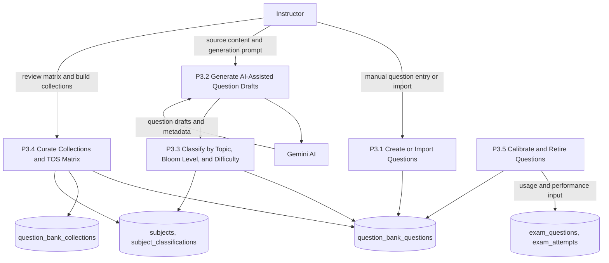
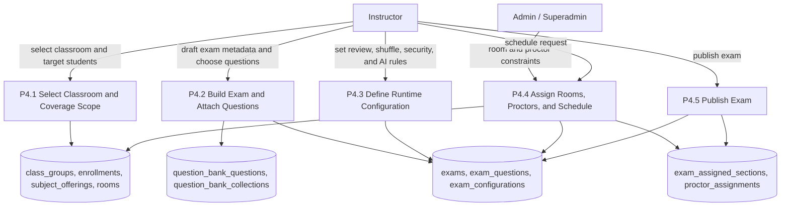
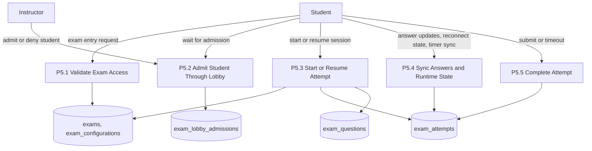
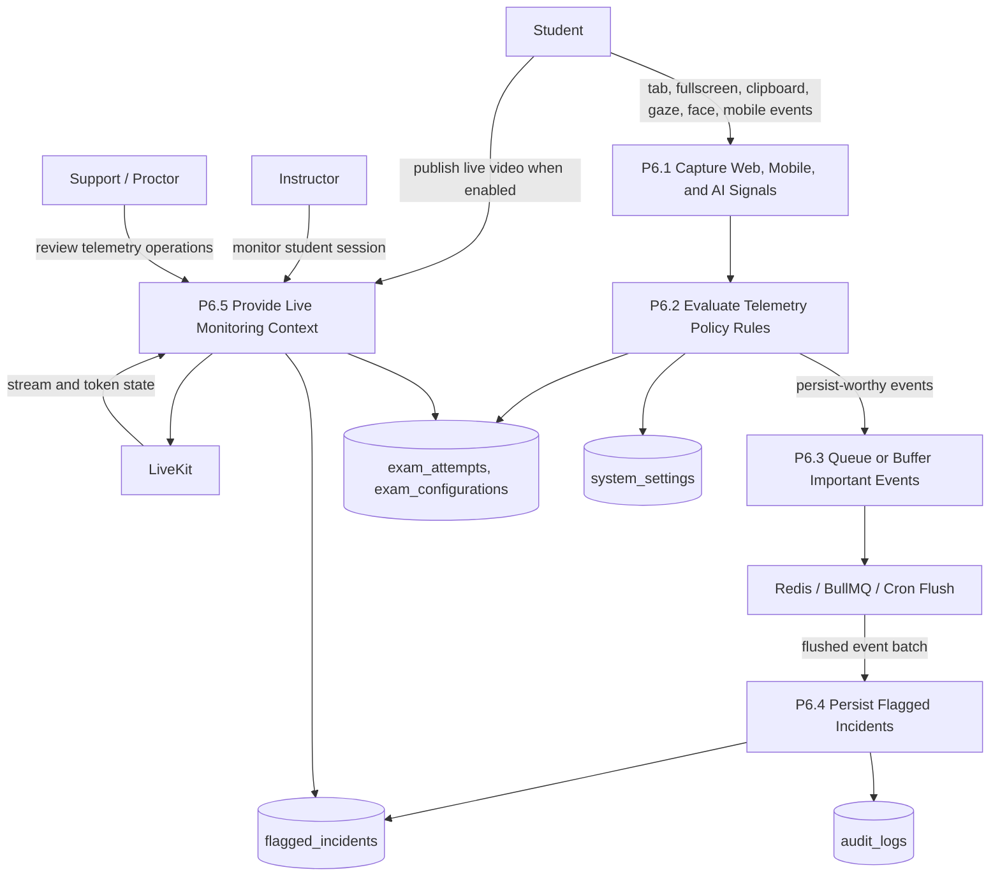
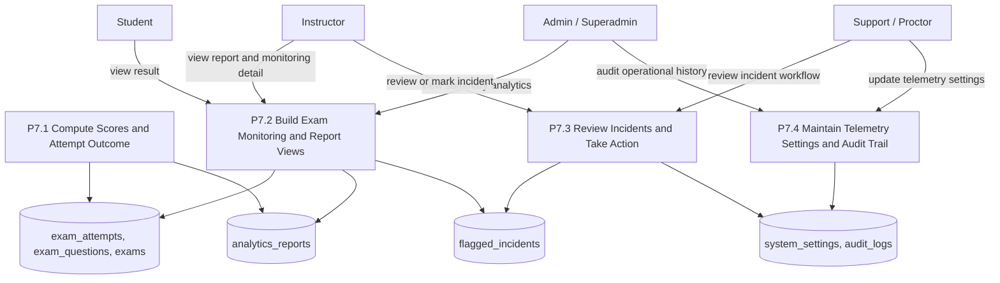

# Sentinel Data Flow Diagrams

This document provides Mermaid.js Data Flow Diagrams (DFDs) based on the current Sentinel system. The diagrams reflect the real platform domains found across `sentinel-web`, `sentinel-core`, `sentinel-support`, `sentinel-mobile`, `sentinel-api`, and the shared database model.

## Scope

The DFDs below focus on the main functional flows of Sentinel:

- onboarding and access control
- academic structure and classroom management
- question bank and TOS-driven assessment design
- exam authoring, publishing, and scheduling
- student exam runtime and progress synchronization
- telemetry ingestion, proctoring, and incident review
- reporting and support operations

## DFD Notation Used

- External entities are shown in square brackets, such as `[Student]`
- Processes are labeled as `P#` or `P#.#`
- Data stores are shown in double parentheses, such as `[(exams)]`
- Arrows represent logical data flow, not deployment topology

## Level 0 DFD: Sentinel System Context

## Level 1 DFD: End-to-End Sentinel Platform

```mermaid
flowchart TB
    student[Student]
    instructor[Instructor]
    admin[Admin / Superadmin]
    support[Support / Proctor]

    auth[Supabase Auth]
    ai[Gemini AI]
    livekit[LiveKit]
    redis[Redis / BullMQ / Cron Flush]

    p1[P1 Access, Identity, and Onboarding]
    p2[P2 Academic Structure and Classroom Management]
    p3[P3 Question Bank and TOS Management]
    p4[P4 Exam Authoring, Scheduling, and Publication]
    p5[P5 Exam Attempt Runtime and Progress Sync]
    p6[P6 Telemetry, Proctoring, and Monitoring]
    p7[P7 Reporting, Review, and Support Operations]

    d1[(users, identities, user_profiles, roles)]
    d2[(student_whitelist, enrollment_requests, instructors, students)]
    d3[(institutions, departments, courses, sections, terms, subjects)]
    d4[(subject_offerings, class_groups, enrollments, rooms)]
    d5[(question_bank_questions, question_bank_collections, exam_configurations)]
    d6[(exams, exam_questions, exam_assigned_sections, proctor_assignments)]
    d7[(exam_attempts, exam_lobby_admissions)]
    d8[(flagged_incidents, analytics_reports, audit_logs, system_settings)]

    student -->|sign in, onboarding, exam participation| p1
    instructor -->|sign in, subject request, classroom use| p1
    admin -->|account and role administration| p1
    support -->|support account access| p1
    p1 -->|auth verification| auth
    auth -->|session and identity data| p1
    p1 --> d1
    p1 --> d2

    admin -->|institution, department, course, term, room setup| p2
    instructor -->|classroom creation, roster management| p2
    p2 --> d3
    p2 --> d4

    instructor -->|question creation, collection curation, TOS review| p3
    admin -->|shared academic metadata| p3
    p3 -->|AI-assisted generation| ai
    ai -->|generated question drafts| p3
    p3 --> d5
    p3 --> d3

    instructor -->|exam draft, configuration, publish action| p4
    admin -->|room and term constraints| p4
    p4 --> d4
    p4 --> d5
    p4 --> d6

    student -->|join lobby, start exam, save progress, submit answers| p5
    p5 --> d6
    p5 --> d7

    student -->|camera, browser, mobile, and client events| p6
    instructor -->|monitoring requests| p6
    support -->|telemetry setting updates and incident review| p6
    p6 -->|room tokens and stream transport| livekit
    livekit -->|live connection state| p6
    p6 -->|buffer, queue, and flush operations| redis
    redis -->|persistable telemetry payloads| p6
    p6 --> d7
    p6 --> d8

    student -->|result viewing| p7
    instructor -->|reports, incidents, grading insights| p7
    admin -->|analytics and audit review| p7
    support -->|incident review and telemetry operations| p7
    p7 --> d6
    p7 --> d7
    p7 --> d8
```

## Level 2 DFD: P1 Access, Identity, and Onboarding

## Level 2 DFD: P2 Academic Structure and Classroom Management

## Level 2 DFD: P3 Question Bank and TOS Management

## Level 2 DFD: P4 Exam Authoring, Scheduling, and Publication

## Level 2 DFD: P5 Exam Attempt Runtime and Progress Sync

## Level 2 DFD: P6 Telemetry, Proctoring, and Monitoring

## Level 2 DFD: P7 Reporting, Review, and Support Operations

## Notes

- These DFDs are based on the current Sentinel modules, service APIs, and Prisma data model.
- `Supabase Auth`, `Gemini AI`, `LiveKit`, and `Redis / BullMQ / Cron Flush` are shown as external supporting systems because Sentinel exchanges data with them but does not own their internal processing.
- The diagrams intentionally use logical process names instead of page-level UI names so they stay stable as the frontend evolves.
