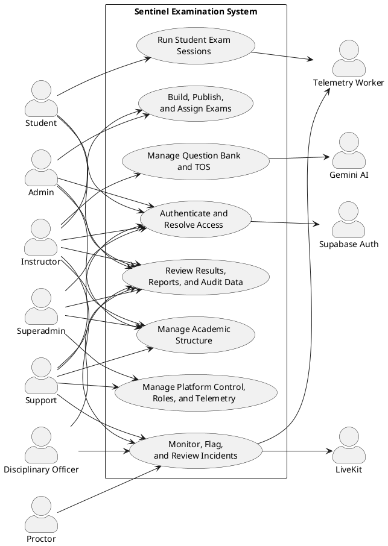
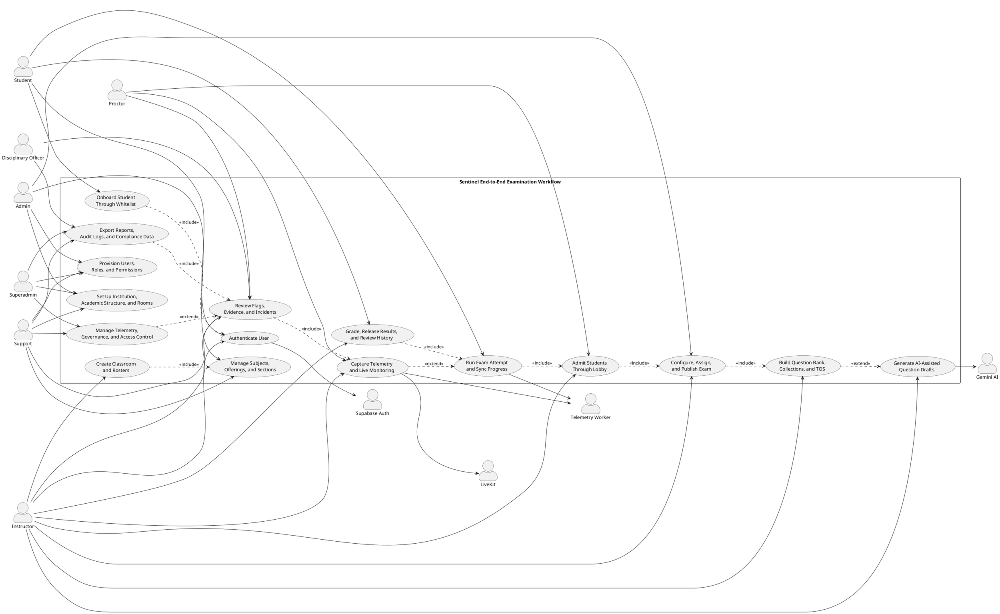
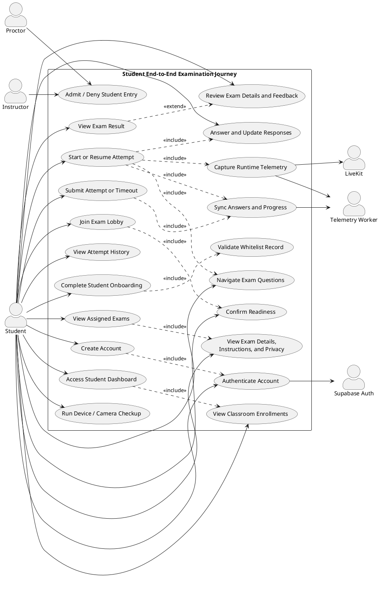
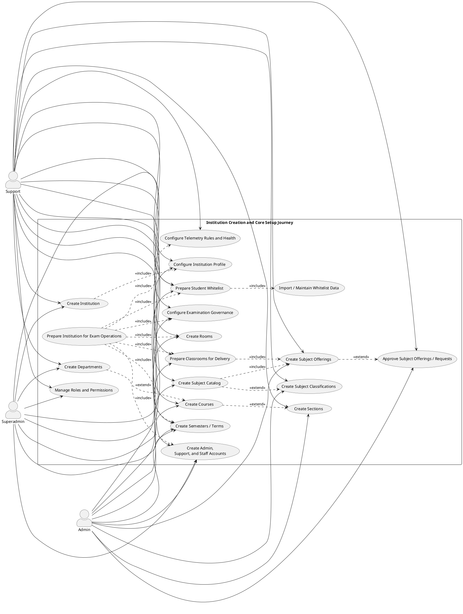
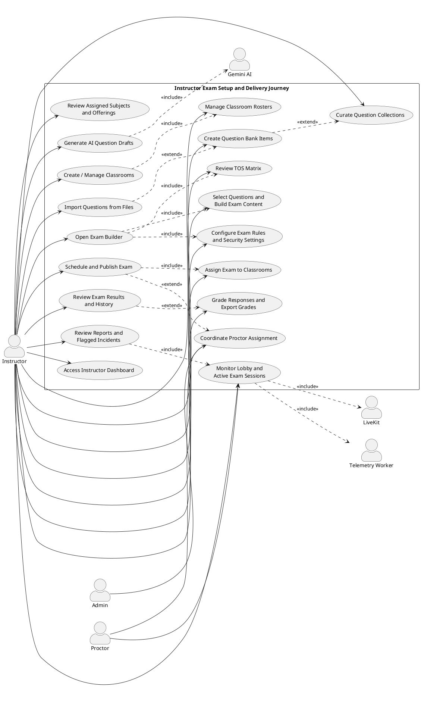
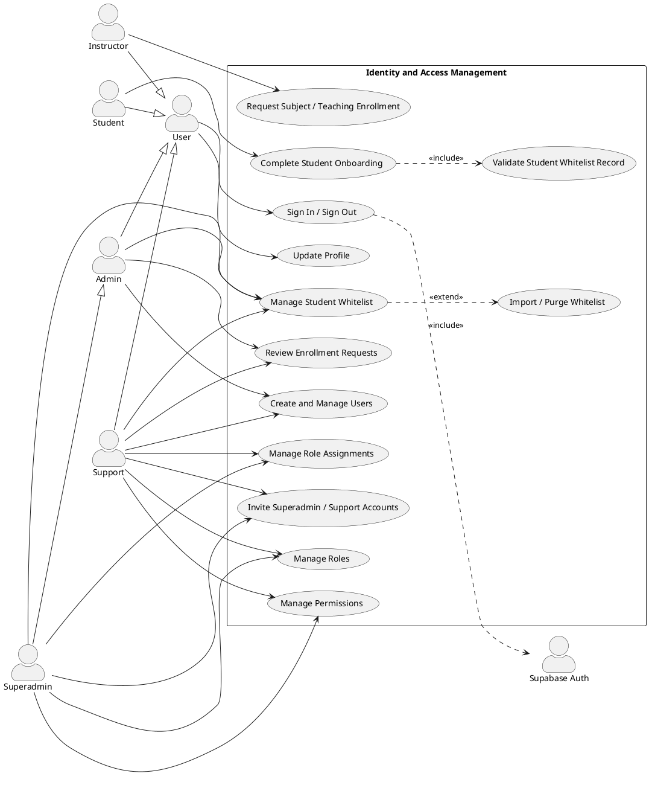
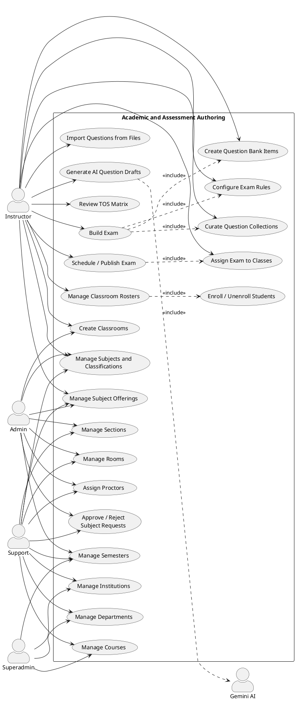
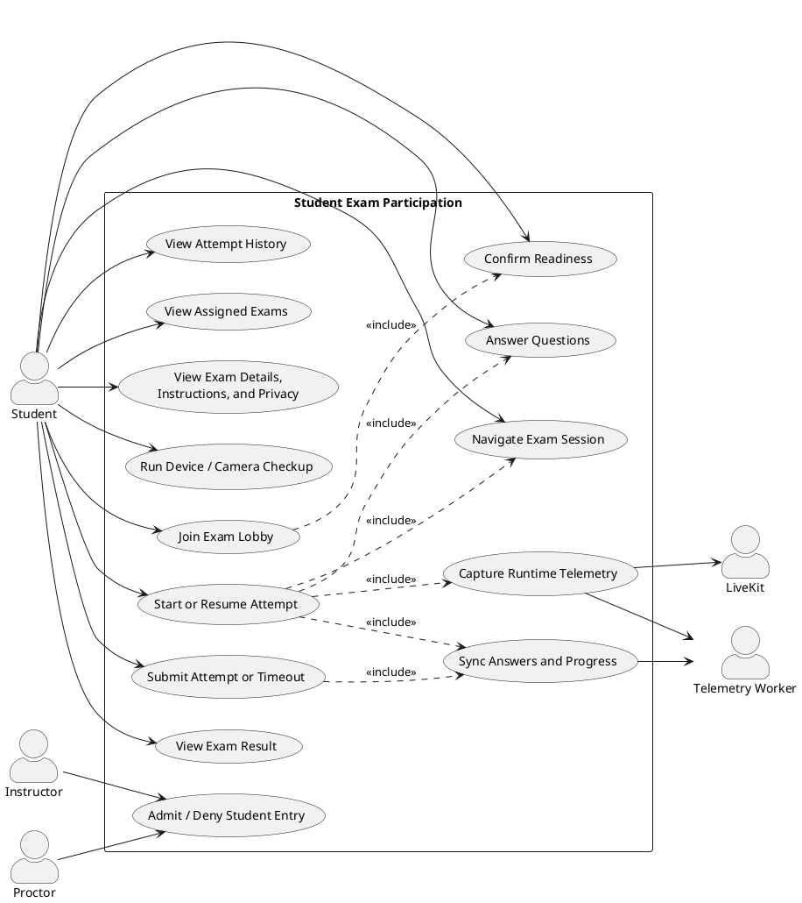
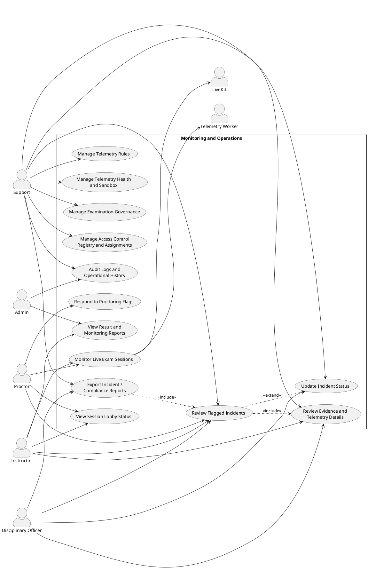

# Sentinel Use Case Diagrams

This document defines PlantUML use case diagrams for the current Sentinel system. The diagrams are based on the implemented role model and workspace/module structure across:

- `app/sentinel-web`
- `app/sentinel-core`
- `app/sentinel-support`
- `app/sentinel-api`
- `packages/shared`

These diagrams are intended to complement the [Data Flow Diagrams](data-flow-diagram.md) by showing actor behavior and system responsibilities rather than data movement.

## Scope Alignment

The use cases below were aligned against the current codebase areas:

- `student` flows in `app/sentinel-web/src/app/(protected)/student`
- `instructor` flows in `app/sentinel-web/src/app/(protected)/(instructor)`
- `admin` and `superadmin` flows in `app/sentinel-core/src/app/(protected)/(admin)` and `app/sentinel-core/src/app/(protected)/(superadmin)`
- `support` flows in `app/sentinel-support/src/app/(protected)/(support)`
- `disciplinary_officer` permissions in `packages/shared/src/constants/permissions.ts`
- platform services in `app/sentinel-api/src/modules`

## Actor Notes

- `Superadmin` inherits higher-level governance and platform oversight responsibilities.
- `Admin` is course-scoped and focuses on academic operations, whitelist management, and approvals.
- `Instructor` owns classroom, question bank, exam authoring, grading, and monitoring inside assigned teaching scope.
- `Student` participates in onboarding, classroom/exam access, exam runtime, and result review.
- `Support` manages platform-wide or institution-level operational controls, telemetry settings, access control, and support accounts.
- `Disciplinary Officer` is an oversight role centered on incidents, evidence review, and compliance reporting.
- `Proctor` remains relevant for live invigilation and flag response, even when some operational views are also accessible to support.

## Diagram 1: Sentinel System Context

## Diagram 1A: End-to-End Sentinel Journey

This view shows the full platform journey across the major actors, from access and setup through exam delivery, monitoring, and post-exam review.

## Diagram 1B: Student End-to-End Journey

This view focuses only on the learner lifecycle, starting from account access and onboarding, then moving through classroom/exam access, readiness checks, active exam participation, and post-exam review.

## Diagram 1C: Institution Creation and Core Setup Journey

This view focuses on the administrative setup of Sentinel from institution creation through core academic data, users, whitelist preparation, and operational readiness for classroom and exam delivery.

## Diagram 1D: Instructor Exam Setup and Delivery Journey

This view focuses on how an instructor prepares, configures, delivers, and reviews an examination from the teaching side.

## Diagram 2: Identity, Onboarding, and Access Control

This view covers authentication, whitelist-backed onboarding, user provisioning, role governance, and permission assignment.

## Diagram 3: Academic Setup, Classroom Operations, and Assessment Authoring

This view reflects the modules used by `admin`, `superadmin`, `support`, and `instructor` for academic setup, classroom delivery, question bank work, TOS, and exam construction.

## Diagram 4: Student Exam Participation Lifecycle

This view focuses on the student journey from exam discovery to result review, including readiness checks, lobby admission, runtime monitoring, answer sync, and submission.

## Diagram 5: Monitoring, Incident Review, and Discipline Operations

This view captures live invigilation, telemetry operations, incident review, evidence handling, compliance reporting, and support-managed governance settings.

## Relationship Guide

| Relationship     | Meaning in Sentinel                                                     |
| :--------------- | :---------------------------------------------------------------------- |
| `Association`    | A role directly performs or initiates a system behavior.                |
| `<<include>>`    | A required sub-behavior always happens as part of a larger use case.    |
| `<<extend>>`     | An optional or conditional behavior is triggered from a base use case.  |
| `Generalization` | A specialized actor inherits the broader capabilities of another actor. |

## Modeling Notes

- The diagrams intentionally separate authoring, runtime, and operations so each figure stays documentation-friendly.
- `Support` is modeled as a strong governance actor because the current support portal includes control, telemetry, user, subject, room, and platform governance areas.
- `Disciplinary Officer` is modeled in the monitoring and reporting domain because the current permission blueprint gives this role incident and report responsibilities, even if the dedicated UI surface is still evolving.
- `Proctor` is retained as a distinct actor because the permission model still defines real-time monitoring and flag-response behavior separately from broader support operations.
- `Gemini AI`, `LiveKit`, `Supabase Auth`, and background telemetry workers are shown as external supporting actors because Sentinel coordinates with them but does not own their internal logic.

## Recommended Documentation Usage

- Use **Diagram 1** when introducing the whole platform.
- Use **Diagram 1A** when you need one end-to-end view of the full examination lifecycle.
- Use **Diagram 1B** when documenting the full student journey from account creation to exam completion.
- Use **Diagram 1C** when documenting institution creation, academic setup, and operational readiness.
- Use **Diagram 1D** when documenting how instructors prepare, configure, publish, monitor, and review exams.
- Use **Diagram 2** for identity, onboarding, and governance chapters.
- Use **Diagram 3** for admin and instructor academic workflows.
- Use **Diagram 4** for the student examination journey.
- Use **Diagram 5** for proctoring, telemetry, incident review, support, and disciplinary workflows.
