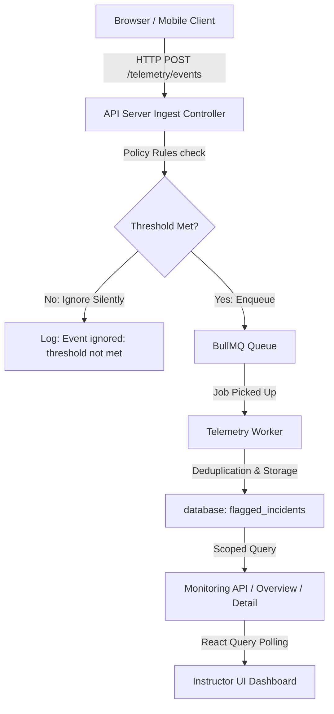

# Telemetry Ingestion and Processing — Production Runbook

This runbook outlines the operational topology, configuration, health monitoring, alerting, troubleshooting, and lifecycle management for the proctoring telemetry pipeline in Sentinel.

---

## 1. Process Roles and Architecture

The telemetry pipeline operates in one of two modes based on the `TELEMETRY_INGESTION_MODE` configuration:

1. **`sync` Mode (Development/Fallback):** Ingestion endpoints synchronously execute policy logic and write directly to `flagged_incidents`. No background worker or message queue is required.
2. **`redis` Mode (Production):** The API server acts as a **producer**, validating payload schemas and pushing accepted jobs to a BullMQ queue backed by Redis. A separate **telemetry worker** process acts as the **consumer**, pulling jobs asynchronously, executing severity/deduplication rules, and persisting incidents.

### Processes in Production

- **API Server / Producer:** Runs `src/server.ts` via `pnpm start`. Secures the endpoints and enqueues events.
- **Telemetry Worker / Consumer:** Runs `src/modules/telemetry/ingestion/workers/telemetry.worker.ts` via:
    ```bash
    pnpm --dir app/sentinel-api start:telemetry-worker
    ```

---

## 2. Configuration Parameters

The following environment variables govern the telemetry module. Ensure they are aligned across producer and consumer deployments:

| Variable                       | Description                           | Default               | Mode     |
| ------------------------------ | ------------------------------------- | --------------------- | -------- |
| `TELEMETRY_INGESTION_MODE`     | Ingestion strategy: `redis` or `sync` | `sync`                | Both     |
| `REDIS_URL`                    | Redis server connection string        | None                  | `redis`  |
| `TELEMETRY_REDIS_QUEUE_NAME`   | BullMQ queue name                     | `telemetry-ingestion` | `redis`  |
| `TELEMETRY_REDIS_BUFFER_NAME`  | Key name for batch buffering          | `telemetry-buffer`    | `redis`  |
| `TELEMETRY_WORKER_CONCURRENCY` | Parallel job concurrency              | `5`                   | Consumer |

---

## 3. Health Monitoring & Status Interpretation

Operational health of the telemetry module is exposed via the authorized `/telemetry/health` endpoint.

### Access Control

Access to `/telemetry/health` is restricted. Clients must supply a valid authorization token for a user with one of the following roles:

- `support`
- `admin`
- `superadmin`

### Response Payload Structure

The endpoint returns a JSON payload detailing the ingestion status:

```json
{
    "status": "healthy",
    "reasons": [],
    "timestamp": "2026-07-23T14:15:00.000Z",
    "ingestion": {
        "mode": "redis",
        "queueName": "telemetry-ingestion",
        "bufferName": "telemetry-buffer",
        "waiting": 0,
        "active": 0,
        "failed": 2,
        "completed": 1420,
        "delayed": 0,
        "buffered": 0,
        "workerCount": 1,
        "oldestWaitingJobAgeMs": null,
        "oldestWaitingJobTimestamp": null
    }
}
```

### Health States

- **`healthy`:** The pipeline is functioning normally.
- **`degraded`:** Telemetry processing is stalled or impaired.
    - Reason `NO_WORKERS`: Redis mode is active, but the queue reports `workerCount: 0`. No telemetry is being processed.
    - Reason `WORKER_COUNT_UNAVAILABLE`: Redis mode is active, but BullMQ could not enumerate workers. Treat this as impaired observability until worker logs and deployment state confirm a healthy consumer.
    - Reason `BACKLOG_STALE`: Waiting jobs in the queue exceed the age threshold of 60 seconds. Indicates worker processing backlog or freeze.

---

## 4. Alerting Thresholds

Configure infrastructure alerting on the following metrics:

1. **Worker Absence:**
    - _Condition:_ `/telemetry/health` returns `status: "degraded"` with reason `NO_WORKERS` for > 2 minutes.
    - _Severity:_ Critical.
2. **Backlog Stale:**
    - _Condition:_ `/telemetry/health` returns `status: "degraded"` with reason `BACKLOG_STALE` for > 3 minutes.
    - _Severity:_ Warning/High.
3. **Queue Growth:**
    - _Condition:_ `ingestion.waiting` count > 1000.
    - _Severity:_ High.
4. **Failed Jobs Growth:**
    - _Condition:_ Rate of change of `ingestion.failed` count > 10/minute.
    - _Severity:_ Warning.
5. **Worker Restarts:**
    - _Condition:_ Telemetry consumer container restarts > 3 in 15 minutes.
    - _Severity:_ Critical.

---

## 5. Queue Diagnostics and Recovery Commands

Support and operations staff can inspect and manage failed or stalled jobs using the `manage-failed-jobs` utility script:

### Summary Mode (Get totals)

```bash
pnpm --dir app/sentinel-api telemetry:failed-jobs -- --mode summary
```

### List Mode (View recent failed jobs)

```bash
pnpm --dir app/sentinel-api telemetry:failed-jobs -- --mode list --limit 20
```

### Clean/Remove Terminal Failures (404/409 errors)

```bash
pnpm --dir app/sentinel-api telemetry:failed-jobs -- --mode remove-terminal --apply
```

### Retrying Failed Jobs

```bash
pnpm --dir app/sentinel-api telemetry:failed-jobs -- --mode retry --apply
```

> [!CAUTION]
> Never run retry or remove commands without explicit approval from a systems architect. Draining the queue or deleting jobs can result in permanent loss of proctoring evidence.

---

## 6. End-to-End Tracing Guide

When investigating missing or delayed proctoring incidents:



1. **Verify Ingest:** Locate the `[TelemetryQueue] Event enqueued successfully` log message. Verify the logged `jobId`, `eventId`, and `attemptId`.
2. **Confirm Status:** Check `/telemetry/health` to verify `workerCount` is > 0 and the queue is healthy.
3. **Trace Processing:** Inspect the telemetry worker logs for `[TelemetryWorker] Job completed`. Note the outcome:
    - `inserted`: A new reviewable row was created in `flagged_incidents`.
    - `aggregated`: Occurrence count was incremented inside the lookback window.
    - `duplicate-ignored`: BullMQ or database deduplication safely skipped duplicate delivery.
4. **Confirm Database Record:** Query `flagged_incidents` using the `attempt_id`. Verify the `dedupe_key` matches the payload's dedupe key.
5. **Verify Selection & Scoping:** Ensure the monitoring API displays the correct operational attempt. The monitoring backend prefers the active attempt (`IN_PROGRESS` or `LOCKED`) over older completed/superseded attempts.

---

## 7. Graceful Shutdown & Process Signals

Both the API producer and the telemetry worker support graceful shutdown on `SIGTERM` and `SIGINT`:

1. The consumer worker stops accepting new jobs and waits for active jobs to complete (up to 5 seconds).
2. Active connection pools (Redis client, BullMQ worker, Prisma client) are closed cleanly.
3. Graceful shutdown ensures no enqueued jobs are corrupted or silently lost during deployments.
