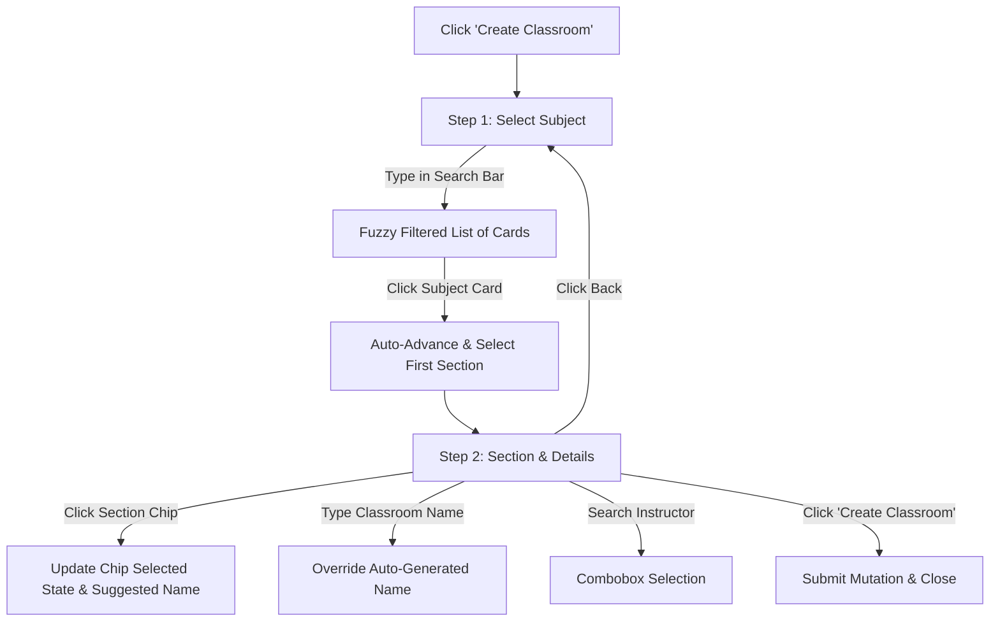

# Implementation Plan — Create Classroom Dialog UX/UI Upgrades

## Summary

The goal is to replace the inefficient dropdown-based classroom creation dialog in `sentinel-core` and `sentinel-web` with a stunning, highly intuitive two-step wizard.

- **Step 1:** Select a Subject (Approved Offering) with real-time fuzzy search, clean visual cards, term indicators, and section-count badges.
- **Step 2:** Select a Section (using tactile chips/buttons instead of dropdowns), customize the auto-generated classroom name, and optionally assign an instructor.

---

## User Review Required

We have carefully designed the step flow to be as seamless and modern as possible:

> [!NOTE]
> **Micro-interaction: Auto-Advance & Smart Prefill**
> When a user clicks a subject card in Step 1, the wizard will **auto-advance** to Step 2, pre-select the **first available section** (using clickable chips), and pre-fill the **classroom name** with the recommended formatting. This allows power users to create a classroom in just **two clicks** (click subject -> click create), while still giving them total control to change sections or names.

> [!TIP]
> **Stepped Progress Indicator**
> We will add a visually appealing horizontal stepper at the top of the dialog (e.g., `1. Subject` -> `2. Details`) to maintain context and set clean visual expectations.

---

## Proposed UI Flow



### Step 1: Select Subject (Approved Offering)

- **Header**: "Select Subject" with subtitle "Search and select from approved offered subjects."
- **Stepper Progress**: Visual progress bar indicating active Step 1.
- **Fuzzy Search Input**: Clean text input with a magnifying glass icon.
- **Card List**:
    - Scrollable area (max height `300px`, sleek custom scrollbar) containing available subjects as cards.
    - Card elements:
        - **Subject Code Badge**: `GENAT01R` in bold, high-contrast badge.
        - **Subject Title**: Bold text e.g., `NATIONALIAN COURSE`.
        - **Term Subtext**: `1st Semester • 2025-2026`.
        - **Section Count Badge**: e.g., `3 sections available`.
    - Selection Interaction: Clicking a card selects it, sets the default section, and auto-advances to Step 2.

### Step 2: Section & Details

- **Header**: "Configure Classroom" with subtitle "Select a section and customize classroom configuration."
- **Selected Context Banner**:
    - Shows selected subject code and title in a padded gray banner with a clickable "Change" text link to go back to Step 1.
- **Section Selector (Tactile Chips)**:
    - Label: "Section"
    - Layout: `flex flex-wrap gap-2` of custom chip buttons.
    - Selection: Selected chip gets high-contrast primary styling (`bg-primary text-white border-primary`); other chips get a clean hover border.
- **Classroom Name Input**:
    - Retains existing auto-generation logic from the code, showing the suggested name.
- **Assign Instructor (Optional)**:
    - _Core version:_ Searchable instructor combobox.
    - _Web version:_ Omitted (since instructor creates it for themselves).
- **Footer Buttons**:
    - Left: "Back" button to return to Step 1.
    - Right: "Create Classroom" (with spinner if submitting).

---

## Proposed Changes

### Sentinel Core (`app/sentinel-core`)

#### [MODIFY] [create-classroom-dialog.tsx](file:///Applications/XAMPP/xamppfiles/htdocs/sentinel/app/sentinel-core/src/features/administration/classrooms/_components/create-classroom-dialog.tsx)

- Add state for current `step` (`1 | 2`, defaults to `1` when opening).
- Add state for `subjectSearch` (`string`, defaults to `""`).
- Filter `subjectOptions` based on the lowercase `subjectSearch` matching `subject.code` or `subject.label`.
- Implement **Step 1 Render**:
    - Stepper indicator at the top of the dialog.
    - Search input with a clean search icon.
    - Grid/list of subject cards.
- Implement **Step 2 Render**:
    - Banner for the selected subject with a "Change" button.
    - Grid of section chips (Tactile buttons) mapping `selectedSubject.sections`.
    - Interactive chip selection.
    - Classroom Name input.
    - Optional Instructor combobox (reusing `InstructorSearchCombobox`).
- Ensure all transitions between step 1 and step 2 reset searches and sync default sections smoothly.

#### [NEW] [create-classroom-dialog.test.tsx](file:///Applications/XAMPP/xamppfiles/htdocs/sentinel/app/sentinel-core/src/features/administration/classrooms/_components/create-classroom-dialog.test.tsx)

- Create a test file verifying the wizard dialog behavior using Vitest:
    - Renders Step 1 with search input and cards.
    - Selecting a subject card auto-advances to Step 2.
    - Renders section chips, custom name, and optional instructor.
    - Clicking a section chip updates the suggested classroom name.
    - Back button returns to Step 1.

---

### Sentinel Web (`app/sentinel-web`)

#### [MODIFY] [create-classroom-dialog.tsx](<file:///Applications/XAMPP/xamppfiles/htdocs/sentinel/app/sentinel-web/src/app/(protected)/(instructor)/classrooms/_components/create-classroom-dialog.tsx>)

- Mirror the wizard state logic: `step` (`1 | 2`) and `subjectSearch`.
- Implement **Step 1 Render**: Stepper, Search, and Subject Cards.
- Implement **Step 2 Render**: Selected subject banner, Section chips, Classroom name input, and Cancel/Back/Submit buttons. (No instructor picker since it's instructor-scoped).

---

## Verification Plan

### Automated Tests

We will execute our Vitest test suite on both workspaces to ensure there are no regressions:

```bash
pnpm --dir app/sentinel-core test
pnpm --dir app/sentinel-web test
```

### Manual Verification

1. Click "Create Classroom" in Sentinel Core (Admin portal):
    - Confirm dialog has a clean progress tracker at the top.
    - Verify Step 1 shows subjects. Type a code in search and verify live filtering.
    - Click a subject. Verify it advances to Step 2 instantly.
    - Verify sections are displayed as interactive chips. Verify clicking other chips updates the classroom name field.
    - Verify clicking "Change" banner button returns to Step 1.
    - Assign an instructor, click "Create Classroom", and ensure creation succeeds.
2. Click "Create Classroom" in Sentinel Web (Instructor portal):
    - Verify identical step wizard behavior, excluding the instructor combobox.
