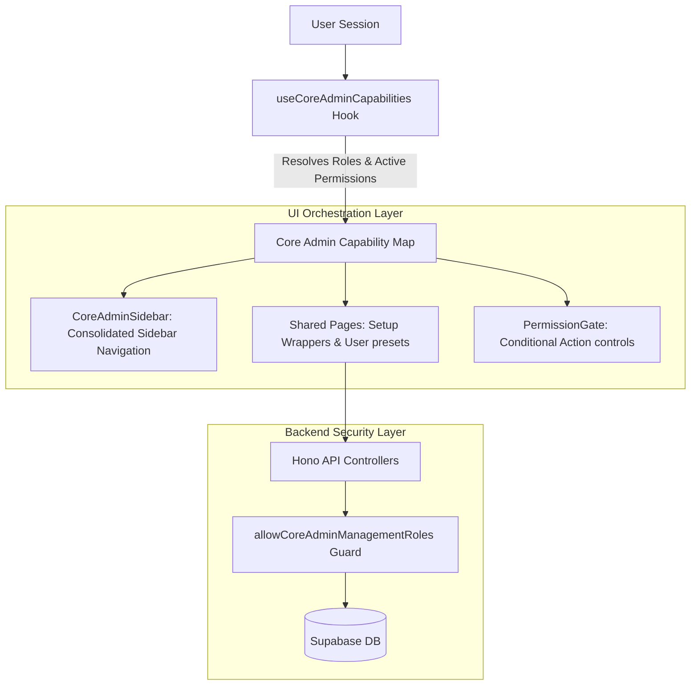

# Sentinel: Centralized Administrator Module

The Centralized Administrator Module unifies the administrative workspace for `admin` and `superadmin` roles in the `sentinel-core` application. By replacing rigid, role-based folder separation with capability-driven client layouts, shared features, and permission-aware backend gates, Sentinel now delivers a seamless workspace where feature access, interface elements, and API mutations scale dynamically according to a user's active permissions.

---

## Architectural Pillars



### 1. Centralized Capability Map (`core-admin-capability-map.ts`)

Instead of branching layouts or routes based on `role === 'superadmin'`, Sentinel uses a unified **Capability Map** defining exact access constraints for every administrative screen.

- **Path:** [core-admin-capability-map.ts](file:///Applications/XAMPP/xamppfiles/htdocs/sentinel/app/sentinel-core/src/lib/authorization/core-admin-capability-map.ts)
- **Concept:** Every page/resource (e.g., `institutions`, `permissions`, `departments`) has a designated `CoreAdminPageId` entry.
- **Rule Resolution:** The map defines which roles (`admin` or `superadmin`) are allowed to access each page and associates exact `rbac_permissions` required to render read-only or read-write controls.

### 2. High-Performance Capability Hook (`use-core-admin-capabilities.ts`)

A single custom hook coordinates all client-side security decisions:

- **Path:** [use-core-admin-capabilities.ts](file:///Applications/XAMPP/xamppfiles/htdocs/sentinel/app/sentinel-core/src/hooks/use-core-admin-capabilities.ts)
- **Interface:**
    - `canViewPage(pageId)`: Checks if the user's role and active permissions permit reading/viewing the page.
    - `canEditPage(pageId)`: Checks if the user's role and active permissions permit adding, editing, or deleting items on the page.
    - `getVisibleNavigationItems()`: Filters and maps navigation lists dynamically for the sidebar shell.

### 3. Declarative Action Guard (`PermissionGate`)

Action-level authorization is declared inline without manual permission-checking logic or complex role conditionals.

- **Path:** [permission-gate.tsx](file:///Applications/XAMPP/xamppfiles/htdocs/sentinel/app/sentinel-core/src/features/administration/shared/permission-gate.tsx)
- **Supported Modes:**
    - `hide`: Renders child elements only when authorized (default).
    - `disable`: Renders children in an interactive-but-disabled state (sets HTML `disabled` and `aria-disabled` flags).
    - `readonly`: Renders forms and interactive elements with a read-only visual state (sets `readOnly` and `disabled` flags).
- **Example Usage:**
    ```tsx
    <PermissionGate permission="users" action="edit">
        <Button onClick={handleCreateUser}>Create User</Button>
    </PermissionGate>
    ```

---

## Route Consolidation & Feature Alignment

### 1. User & Administrator Management

Legacy structures branched `/users` (for instructors/students) and `/administrators` (for admins). These have been consolidated:

- **Shared Feature Page:** [user-management-page.tsx](file:///Applications/XAMPP/xamppfiles/htdocs/sentinel/app/sentinel-core/src/features/administration/users/user-management-page.tsx)
- **Routing & Presets:**
    - `/users` renders the shared feature page loaded with the `USER_MANAGEMENT_PRESET`.
    - `/administrators` renders the shared feature page loaded with the `ADMINISTRATOR_MANAGEMENT_PRESET`.
- **Form Hook:** [use-managed-user-form.ts](file:///Applications/XAMPP/xamppfiles/htdocs/sentinel/app/sentinel-core/src/features/administration/users/hooks/use-managed-user-form.ts) handles validation, default presets, and academic scope locking cleanly for both targets.

### 2. Institutional Setup & Support Portals

Setup screens (`institutions`, `departments`, `semesters`) have been synchronized so both roles access the same pages, with actions restricted based on permission keys:

- **Support Portal Handshake:** [support-portal-bridge.tsx](file:///Applications/XAMPP/xamppfiles/htdocs/sentinel/app/sentinel-core/src/features/administration/setup/shared/support-portal-bridge.tsx) presents a seamless read-only dashboard for administrative users, providing deep-links to the Sentinel Support Portal for write access when required.
- **Shared Permissions Table:** [permissions-page.tsx](file:///Applications/XAMPP/xamppfiles/htdocs/sentinel/app/sentinel-core/src/features/administration/setup/permissions/permissions-page.tsx) allows both roles to view role-permission matrices, reserving edit actions (creating/updating roles) exclusively to active permission holders.

---

## Centralized Access & Permission Matrix

| Page ID / Resource | Allowed Roles         | Required Read Permission | Required Write Permission | Support Portal Bridge Handoff |
| :----------------- | :-------------------- | :----------------------- | :------------------------ | :---------------------------- |
| `overview`         | `admin`, `superadmin` | _None (Default Access)_  | _None_                    | No                            |
| `sections`         | `admin`               | `sections:read`          | `sections:write`          | No                            |
| `users`            | `admin`               | `users:read`             | `users:write`             | No                            |
| `administrators`   | `superadmin`          | `users:read`             | `users:write`             | No                            |
| `permissions`      | `admin`, `superadmin` | `roles:read`             | `roles:write`             | No                            |
| `institutions`     | `admin`, `superadmin` | `institutions:read`      | `institutions:write`      | Deep-link to Support Portal   |
| `departments`      | `admin`, `superadmin` | `departments:read`       | `departments:write`       | Deep-link to Support Portal   |
| `semesters`        | `admin`, `superadmin` | `semesters:read`         | `semesters:write`         | Deep-link to Support Portal   |
| `courses`          | `admin`, `superadmin` | `courses:view`           | `courses:create`, `courses:update`, `courses:delete` | No |

---

## Backend Security Configuration

The Hono API layers ensure that any consolidated frontend operations are validated by matching backend route guards:

- **Route Guard:** `allowCoreAdminManagementRoles(method)` evaluates incoming HTTP methods against role profiles and academic scopes.
- **Scope Wideening:** GET endpoints permit cross-institutional reading for authorized administrative profiles while restricting unsafe mutation operations to designated users with active permissions.
- **Affected Route Gateways:**
    - `app/sentinel-api/src/modules/core/departments/departments.routes.ts`
    - `app/sentinel-api/src/modules/core/institutions/institution.routes.ts`
    - `app/sentinel-api/src/modules/core/semesters/semesters.routes.ts`

---

## Release, Validation & Safety Controls

### 1. Verification Coverage

A robust suite of **50 unit and integration tests** guards the entire administration surface against future regressions:

- Dynamic Hook Cases: [use-core-admin-capabilities.test.ts](file:///Applications/XAMPP/xamppfiles/htdocs/sentinel/app/sentinel-core/src/hooks/use-core-admin-capabilities.test.ts)
- Navigation Shell Cases: [core-admin-sidebar.test.tsx](file:///Applications/XAMPP/xamppfiles/htdocs/sentinel/app/sentinel-core/src/components/sidebar/common/core-admin-sidebar.test.tsx)
- UI Primitives: [permission-gate.test.tsx](file:///Applications/XAMPP/xamppfiles/htdocs/sentinel/app/sentinel-core/src/features/administration/shared/permission-gate.test.tsx)
- Setup & Handoff Primitives: [support-portal-bridge.test.tsx](file:///Applications/XAMPP/xamppfiles/htdocs/sentinel/app/sentinel-core/src/features/administration/setup/shared/support-portal-bridge.test.tsx)
- Course Management Cases: [courses-page.test.tsx](file:///Applications/XAMPP/xamppfiles/htdocs/sentinel/app/sentinel-core/src/features/administration/courses/courses-page.test.tsx)

### 2. Zero-Downtime Rollback Plan

Since the database schema has not been altered, the entire client-side workspace centralization can be hot-reverted instantly by resetting route configurations and layouts:

1. Revert route layout delegation in `app/sentinel-core/src/app/(protected)/layout.tsx`.
2. Swap legacy sidebar references back to their role-specific counterparts.
3. Re-enable the legacy folder structures under `app/sentinel-core/src/app/(protected)/(admin)` and `(superadmin)`.
